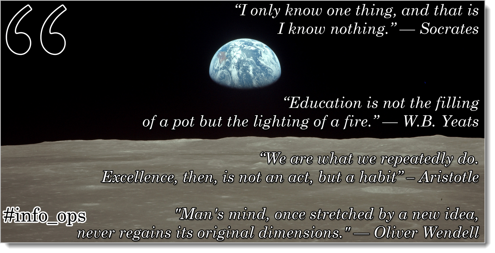
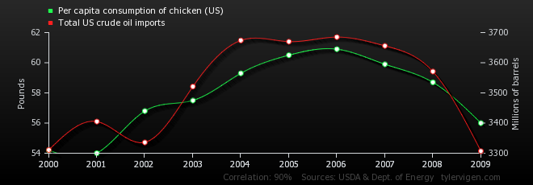
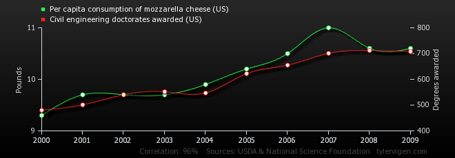
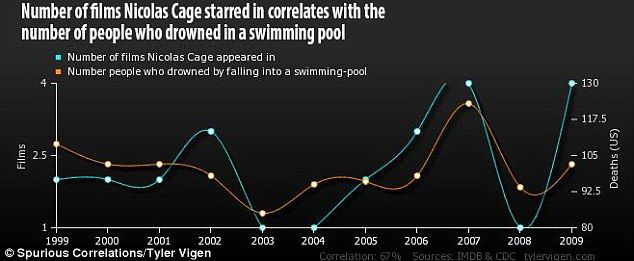
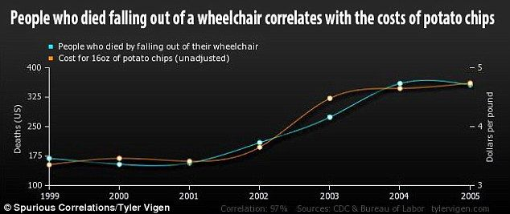
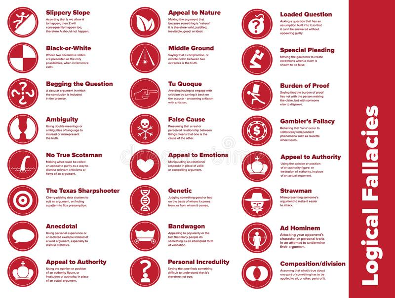
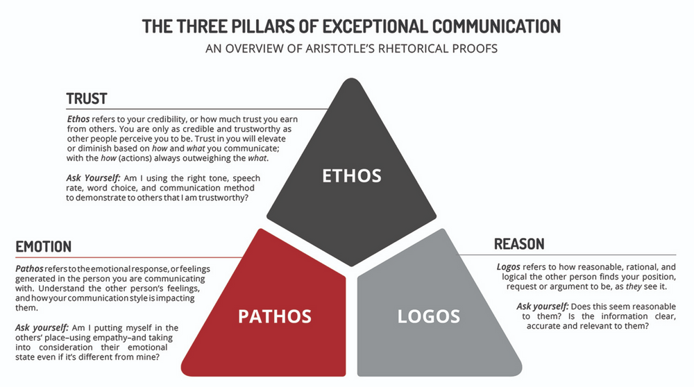

# Foundations #

# Learning is Being Wrong

[^^grow-up-astrophysics-for-people-in-a-hurry]

Childhood is a time to be presented with overly-simply, mostly-false versions of the way things work. It's not because we don't like children; it's because overly-simple versions of things can work just as well as complex ones in a large number of situations. Don't go near traffic. Don't play with fire. Never use violence. Don't take candy from strangers. The interior angles of a triangle always add up to 180 degrees. In 1492 Columbus sailed the ocean blue. You all the numbers by counting. Fluffy must have ran away. There's a large man in a red suit riding a flying sleigh that breaks into our houses once a year and leaves presents.

It's not that any of these statements are totally false. It's that we provide the little growing people we love with models simple enough that they can use with their current intellectual ability to navigate the world.[^grow-up-dont-confuse-explaining] Life (and science) is always a process of using one rough model after another, modifying and reworking as necessary to work on more and more complex and complicated things. In fact, the secret of a good life can be thought of as keeping things as simple as possible as long as possible, but never a bit longer. Growing up means understanding how many levels and how much uncertainty is under it all, then diving down as necessary when you need something to work that's not currently working at the simplification level you're using. Otherwise don't sweat it.

Being simple is great. It's a gift. Being simple-minded is not. It's a curse.

It's time for many of us to intellectually grow up.

***

***

## How to get yourself manipulated in five easy steps

Would you like to be manipulated? Have other people tell you what to do, control your life? It's easy!

1. Observe a complex system
2. Have somebody tell you what the two most important variables are for that system Social cues count here much more than anything else. It's not science, it's a popularity contest. We are herd creatures.
3. Observe and torture data to make nice charts
4. Draw conclusions from whatever spurious correlations you can find
5. Intervene in the system
6. Go to #1

It's amusing how easily we see this in others yet somehow refuse to believe that we're just as culpable. We always know the right definitions and when to simplify or not. Those other folks never do.

- There is a bright flash of light and loud sound! (Thunder and lightning) It is Thor!
- There is a bright flash and loud sound when it rains! Thor uses rain to work on his hammer
- There is a bright flash and loud sound sometimes when it rains. Thor only acts at certain times
- There is a bright flash and loud sound sometimes when it rains, but only when very warm weather is followed by much colder weather. Perhaps Thor's wife gets angry? (and so on)
- Severe thunderstorms in a supercell configuration are a product of a dry line intersecting a strong cold front facilitated by a strong dry adiabatic lapse rate along with weak steering winds aloft ...

**If a level works for you, who cares?** You don't need to study nuclear physics to work the microwave. If you're getting ready to go outside and I tell you to take an umbrella because my pet rock said rain was coming, and you've seen my pet rock be correct before, there's nothing wrong with taking that umbrella. Curiosity and continuously learning is the greatest goal I think a person can have, but actually living life isn't some search for the ultimate meaning and cause to everything you come across. All the science and technology we have in the modern world works because some group of folks over the ages learned things at a killer level of detail, but that somebody doesn't have to be you. Most importantly, it can't be you. Each specialized field has dozens or hundreds of (relatively) minuscule concepts that don't work together for the people who are experts, so not only are you not smart enough to know everything, even knowing a very tiny amount of the total knowledge in any topic would lead to contradictions and quandaries. Everything in life isn't already explained and understood by somebody else and easily understood by you. Hell, it's not even understood by them. To think otherwise is to be a child.

**There is no done.** There is no natural place to stop. This isn't a ladder. One level isn't wrong and the other correct. If you keep taking apart reality and causality, you end up with non-locality and non-causality. And that's only talking physical systems. That's not even getting into primitive biological systems, or ecosystems, or sentience. The universe far, far exceeds our ability to understand it all at once. We think of any ignorance at all as cheating, but cheating isn't cheating. Cheating is life. It's survival. But yeah, you're not learning as much as you might be able to. It's also cheating. Both of these things are true at the same time.

## Damn, those other guys suck

It's not an unexpected thing in life that members of religions and political parties all accuse the members of differing groups of having overly-simple ways of looking at the world. It's the basis of most cultural warfare: we're the ones who understand the details and complexities required in this area. You guys are the ones living in a overly-simple world. Can't you see the important things you're missing here! And there you go into all of this detail on these other things that aren't important at all!

> There's nothing in life that's not [multivariate](#definition-multivariate) and where the definitions are not in flux. Many systems of interest are chaotic.[^grow-up-yes-there-are-simple-explainable] But humans can't communicate in multivariate chaotic formulae, even if we all worked from the same definitions. Our species is always in failure mode. The only question is whether the current mode matters or not for the particular goal under discussion

It's important to understand our failure modes:

- There is nothing to know. We just exist. (sounds)
- Deities control things. There are things to know but they're not ultimately important (language, myth)
- Our tribe understands collectively things that each of us may not (social coherence)
- Some things are true no matter what but we do not know them (mysticism)
- Everything has an ultimately-true name. There is one ultimate and true language. Knowing that language will allow us to control the universe (magic)
- Many tribes have gathered and agreed that for certain things certain people will understand the world so that we don't have to (religion)
- Patterns can be observed that tell us all we can know about existence (abduction, natural philosophy)
- We can symbolically-reason about everything, even things we cannot observe (Platonism, philosophy)
- Everything can be learned from other things (deduction, geometry)
- These patterns hold true throughout the universe (induction, science)

Each of these is both useful at times and wrong at times. These are all failure modes. We use things that work and we stay aware of when they might stop working.

People tend to get stuck on one failure mode or another. I guess we all have favorites.

## Fuck, I suck too

Why am I writing this? I'm writing it because I need you to engage me with intellectual discourse on complex topics of the day. Instead, when I go online, I see people throwing around hot takes and cheap shots at all levels, refusing to acknowledge the other levels may exist.

What does it mean to intellectually grow up? It means intellectual humility, the simple fact that you and your social group (close or extended) don't know most things, no matter how sure you are about it. Aside from math/formal systems, the only way we truly know anything is by honest conversations between people of drastically different experiences and worldviews. Knowledge is not a social construct, but webs of related fine-grained siloed definitions are, and such webs are always necessary in our common search for knowledge. That means that the constant chaos, mixing, and stirring across social groups is the prime prerequisite for our own evolution. It always has been. If you're one of those folks who search for universal wisdom, you're on a search for definitions that work among the largest set of people over the longest period of time.

Oddly enough, true education is the opposite of what many think it is. For many, becoming educated means knowing things and feeling assured that there are no important questions left in the fields you have studied and that you have now become more capable and powerful than those without an education. In fact, true education is learning the depths of the unknowns and contradictions we observe (E pur si muove) and developing personal habits to take you and the rest of us just a little bit out of that state. It's a curiosity. It's a growing wonder at the vastness of existence and our place in it. It's a profound ignorance. It's intellectual humility. It's understanding our own limitations. It's knowing that we're never wrong in a way that we'll never be able to easily understand ourselves[^grow-up-necessary-discussion]

None of us have any idea where our personal evolution or the evolution of our species will take us. We all must understand logical fallacies and the tools of rhetoric and persuasion, but our grandchildren desperately need us to both use and transcend them. If you'd like this is a values or morals format, cherish and respect other human beings, most especially those you think are oversimplifying important parts of life, people you may find rude and hateful and doing your best to listen to and understand them. By doing so we understand ourselves. By understanding ourselves our own education and the education of others can continue.

It's time to intellectually grow up.

![Political memes, like flamethrowers, are hella fun on very special occasions. There are many variations on this cartoon illustrating a concept loosely labeled "Equality of Outcome" It reduces a complex topic, society and governance, to two variables with devil-may-care definitions. It's all about watching a baseball game. The premise is that there is a unique thing called a game, and that we all have the exact same desire to see that game. Here, everything in governance reduces to two variables to optimize, then we are told to optimize. The feeling and intent may be great and noble. The information content is zero. (In fact, it's negative. It's encourages harmful reductionism. Because it's purposely misleading, you become dumber consuming things like this, no matter what your politics)](resources/images/grow-up-euality-of-outcome.jpg)

[^grow-up-dont-confuse-explaining]: Don't confuse this with explaining the universe at any level of detail a child requests. It's love, not malice. If a child asks me why something is, like the sky is blue, I will explain for as long as I am able and they are interested. But I'll also point out that for all intents and purposes, it just is. Because I said so. We explain the depth of the structures and universe around us to provide a sense of wonder and curiosity, not because there's going to be a test. The child gets to choose where to go from there. (And don't get me started on Santa)

[^grow-up-yes-there-are-simple-explainable]: Yes, of course there are simple, explainable and reproducible systems, otherwise science couldn't exist. The problem is that this simple idea is easily over-applied without anybody realizing it. We easily move from science to almost-science to scientific-guesswork to scientific-consensus to pseudoscience without anybody, including the practitioners, realizing it.

[^grow-up-necessary-discussion]: There is a necessary and useful discussion to be had about the role of kooks and cranks. It's unlikely the uneducated, illiterate man digging your septic system has much to say about 18th-century Russian literature and how it was influenced by Voltaire. The problem is that this simple idea is over-applied without anybody realizing it. This is a discussion we're purposefully ignoring today, mostly because it's far too easy to game this idea to apply anywhere you desire. It deserves its own essay.

[^^grow-up-astrophysics-for-people-in-a-hurry]: ![Universe quote is from "Astrophysics for People in a Hurry", Neil deGrasse Tyson (Author), 2017 ed.]<https://amzn.to/3uMAuSQ>

# On the importance of being wrong:

I make a lot of mistakes. Matter of fact, most of what I do and say is a mistake, measured by some metric. It's important to understand that, not in order to be a humble, better person or participate in a flavor-of-the-week self-improvement program, but the deeper knowledge that *everything learns by being wrong first*.

Don't believe me? Here are some places where being wrong is the most important part of existence.

- Training data and quality control for AI and Machine Learning, such as GPT-3
- Generative Adversarial Networks, or GANS, are entirely based on being wrong quickly and adjusting, even if there's no definition at all of what defines "wrong"
- Learning to feed yourself
- Learning to walk
- Forming a startup
- Making your startup successful
- Organizing knowledge workers
- Keeping an organization flexible and competitive

The GAN item is especially interesting because here we use the concept of wrong at huge scale and at a high rate of speed, even without really knowing what wrong means.

Whether it's machine learning, organizational learning, startups, or human learning, any sort of learning at all begins with some knowledge of how you're wrong. We call this knowledge "the feedback loop". If you've worked with organization or management people very long, you'll hear them talk about feedback loops. Oh my goodness, we love our feedback loops. Unfortunately, the phrase "feedback loop", is thrown out many times into discussions without anybody having any clear idea of exactly what's involved with it.  

So to begin our journey, before we do anything else, we're going to have to talk about being wrong: In popular English, instead of saying "I was wrong", we can say screwing up, striking out, eating dirt, going down in flames. (We have so many different euphemisms for being wrong. There's a reason for that.)

So it's being wrong, then feedback loops, then we're ready to start talking about learning at scale.

