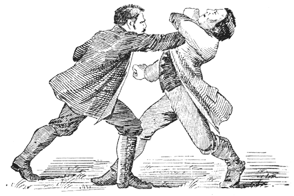
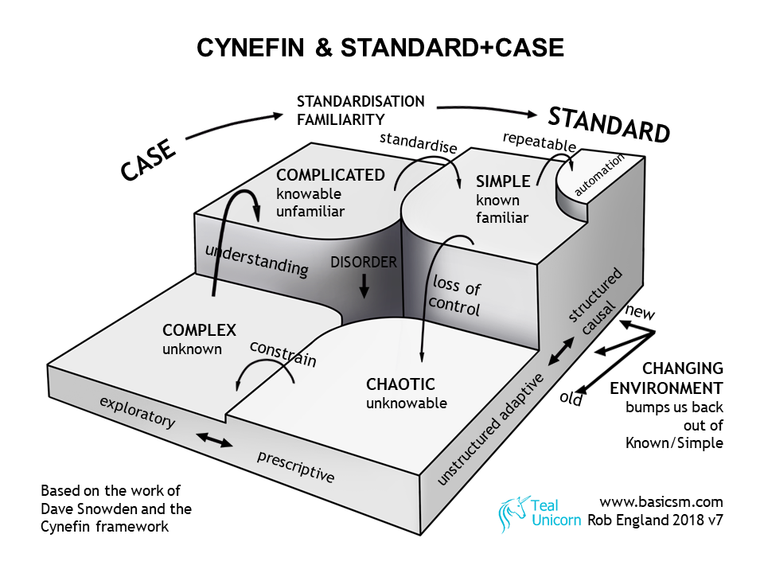

# The Great Reckoning

I grew up in a rural area. Out here, we have a word that you might have heard on radio or TV: reckon. It's a standard English word but for whatever reason I find it used much more in rural, southern, and perhaps a bit uneductated settings. It's a modifier, usually used after a pronoun, as in "I reckon I'll go down to the bank this afternoon", or "You reckon that's clean enough?"

Reckon comes from navigation, and it's generally used where the speaker is unsure of their statement but feels the need to make the statement anyway. It implies a certain ambivalence or apathy towards the topic at hand. This is why it has a bit of a connotation that the speaker is uneducated. We naturally feel that educated people should know exactly what they want to say and to say it forcefully. If you're not that sure of yourself, maybe you need tpo learn more. (Reckoning can also be used as a form of the word "judgment", and in the past the phrase "The Great Reckoning" was used as a placeholder in many religions for doomsday, the end-of-the-world, when all people would be judged. That's what makes the title to this chapter a pun. Dad Jokes for the win!)

After more than forty years of writing code, architecting systems, and working with companies doing cool stuff all over the globe, when I first sat down to write about problem-solving using computers I was faced with a problem that seemed insurmountable: every topic I touched upon seemed to have a hoard of academics at hand ready to argue that it should be defined one way or the other. They seemed quite sure of themselves and forcefully made their case. In most cases, each side had a lot going for it.

This topic was important, they said and wrote. If you don't understand this topic and have the proper definitions in place, how can you move forward? In many areas there were unsolved problems that looked like they might remain unsolved for decades to come.

I spent several years mid-career trying to speak and write around these topics. Frankly, it hurt both my learning ability and my ability to communicate well with others. Sometimes you're unsure of a statement but need to make it anyway. Describing the twelve ways you *could* state things isn't helping anybody. You need to start reckoning. Authors do this all of the time, whether we realize it or not. Some examples:

- I reckon one day it might be possible to go faster than the speed of light, it just might be hundreds of years from now.
- I reckon Frodo is never going to make it all the way to Mordor with that ring.
- I reckon the universe is about ten billion years old, and started with hyper-inflation.
- I reckon we're going to be stuck with more urban unhappiness as long as we keep this certain policy.

In each case, the reader and writer are forced to take some sort of stand, place a stick in the ground, in order to move on. In some cases these reckonings are critical to the story or hypothesis. In some cases they could either be true or not; it's more important to our narrative that a stand be taken than it is what that actual stand is.

I realized that I had to do a lot of reckoning if I wanted to learn and talk about complex topics, otherwise I could write books worth of material and never get anywhere near where I wanted the reader and I to go. I have done so here. I try to call these out and provide plenty of resources for further investigation. I've also tried to pick conclusions and the assumptions/reckonings that go into them in such a way that you could change up the assumptions and still argue your way to the same conclusion. Frankly, I've just picked the assumptions that are easier to understand. I reckon they'll have to do for now.

Here are some topics that might seem critical for our book. I do not believe this to be the case, but I can understand where others migh disagree. I reckon I'm going to explain and use them this way. We can always pick something else later, but we gotta start somewhere. Some of these might seem silly to the average reader, but I can assure you that for many people they are not.

Below I will state what I reckon in italics, then a short defense of it.

## Programming or Math is Very Different From Programming or Math

*Programming or Math, I reckon it's the same thing as far as this book is concerned*

Programming and math are not the same, but they're close enough not to bother differientiating them in this book. We have Turing machines, Church Lambda calculus, and many of the other foundations of modern computing because mathematicians were looking for a way to use symbolic logic to prove mathematics. In this way, we can consider these mathematicians the first programmers.

Today we use formal symbolic, calculateable systems (computer programs) to create many different systems of logic that we can use to explore various business domains. Mathematicians went on to generalize mathematics (mostly) into Category Theory, which can be used to create the majority of math fields today. Category Theory also maps directly to pure functional programming languages. In fact, programming languages like Haskell can be thought of as an effort to keep Category Theory and programming in lockstep.

Surprisingly, this means that pure functional programs are one and the same as mathematical proofs, only using symbols the programmer supplies instead of things like the natural numbers. This is the famous Curry-Howard isomorphism you may have read about. It also means that once we leave the world of pure functional coding, the analogy completely fails.

So when you build a purely functional program around rules for something you're observing, say rabbits, you're effectively creating your own new branch of rabbit mathematics, with it's own symbols and rules. Math generalized itself into Category Theory, a way to create your own mathematical systems, then programmers made that available to the average coder.

So yes, most code is not purely functional and my equivalence falls apart, but we're going to use "programming" to mean purely functional programs conforming to something like the rules of Haskell, and we're going to use the word "math" to mean those branches and applications of mathematics that can be derived from Category Theory. As long as we keep those differences in mind, we're good.

## What is Learning?

*I reckon learning is being able to state how things are put together and being able to do stuff.*

From the "Seemingly Stupid Question Department", if we're going to study learning, what, exactly, does it mean to learn? That is not as easy of a question to answer as one might guess.

The word "learn" is ususally used in combination with the word "know". Learning is what you do in order to know things. If you learn how to add numbers, you know addition. If you learn the names of continents, you know some geography. If you learn about Emily Dickenson, you know some poetry. If you learn fine dining, you know how to pick a wine for a meal. If you learn right from wrong, you know what choices you should make in difficult situations.

If you've noticed, I went from learn/know in a concrete setting, addition, to a setting that we could argue about all day, personal morality. Hell, I could argue morality with myself. I tend to do so in difficult situations. Yet in all of these cases the pair of learn/know is used in the same way.

We're going to declare two kinds of knowing: knowing-what and knowing-how. Knowing what is being able to provide a structural answer, such as a list of things, or the way certain topics relate both to each other and a parent, such as we just did with math and programmingc. Knowing how consists of proving a recipe to create a structure or behavior. This recipe consists of steps. Each step describes an initial structure, an operation, and a desired ending structure. Tests can be provided for each step such that the practitioner can replicate the recipe on their own, given that their understanding of all of the structures involved is close enough to the person providing the recipe.

That's a mouthful of word. Knowing-what are things you can look at and/or diagram. Knowing-how are things you can do. Each of these have their own unique ways of disagreement or misunderstanding when we share them with others, and each of them have different strategies we use to work through those disagreements or misunderstandings.

## Does Anything Exist?

*I reckon it doesn't matter, as long as we can do the useful stuff we want to do.*

This is the famous "brain in a vat problem". Differing levels of consciousness are by definition completely unaware of higher or lower levels, wehther they're directly integrated with them or whether they're simulated. It doesn't matter in a way that we can do anything with.

## Is Science Stuff We Know or Just Stuff We're Really Good at Guessing At?

*I reckong science is just being really good at how some organization of things is going to look like at the end if we set up a initial group of things a certain way and then do certain things to them.*

Any reasonable study of science over the last four thousand years has to conclude that whatever we call science at the time is just stuff we're really good at guessing at. Over time we've gotten better and better at guessing. For many, they don't understand the point here. If I "know" with a 99.999999999% accuracy that gravity will work in a certain way given a certain situation, I know that, right?

Yeah, not so much. Yes, you can use it, rely on it, build on it, and create awesomely cool stuff with that knowledge. But what you're really saying is that you know-how to that degree of accuracy. You may just have guesses in the know-what department. If those guesses work for you? Via con dios, my friend. Newton was disraught when he came up with the theory for universal gravitation because he had figured out *how* to calculate gravity, but he had no idea really *what* gravity is. That was Newton. That was hundreds of years ago. We still don't know.

I'm no Newton. I'm not even close. When we get to learning and science later in the book, it's just going to be "stuff we're really good at guessing at given these structural assumptions". Both of these things seem to compose and stack on top of one another as we continue the decade-by-decade march of progress. Works for me. But it's just guessing. While the difference is not important to your average research biologist, nuclear sub technician, family doctor, or college professor, it matters a lot to us when we begin talking about how humans and computers can interact to create science even faster.

As we'll see over and over again, living our day-to-day lives is a pretty natural and easy thing to do. As we take that natural world and scale it way far down into the quantum world or way far up into cosmology, it gets freaky. The details start to matter a lot. The same thing happens when we talk about scaling up the complexity, speed, or size of computer systems. It happens when we tease apart what it means to learn or know anything. Details, edge cases, and oddball stuff we can observe but not understand will destroy our progress if we obsess on them. We may live in a giant simulation that was only created five minutes ago, but it's still our universe and we are required to deal with it as best as we can. We don't have to understand everything, we just have to have good enough guesses that work with one another in order to move forward. I am reminded of a phrase I heard in a movie once. "Yeah, that guy may be a real asshole, but he's *our* asshole".

{width: "33%"}

## The Bayesians versus the Frequentists: Cage Match!

If you thought the tabs-versus-spaces guys in programming were going to argue forever, that's nothing compared to the long-running fight between the Frequentists and the Bayesians.

Here's a rough swag at explaining the differences:

***[Ed: the following is pulled verbatim from a blog. Need to restate as the book develops.]***

### Use of Prior Probabilities

The use of prior probabilities in the Bayesian technique is the most obvious difference between the two. Frequentists believe that there is always a bias in assigning probabilities which makes the approach subjective and less accurate. Bayesians, on the other hand, believe that not assigning prior probabilities is one of the biggest weaknesses of the frequentist approach.

#### Data Prediction

Since the Frequentists don’t believe in assigning prior probabilities, their estimate is based on the maximum likelihood point. Bayesians, on the other hand, have a complete posterior distribution over possible parameter values. This allows them to account for the uncertainty in the estimate by integrating the entire distribution, and not just the most likely value.

#### Mitigating Uncertainty

The Bayesian approach to mitigating uncertainty is by treating it probabilistically. Frequentists don’t have that luxury. However, this doesn’t mean that there is no uncertainty in the frequentist approach. The estimate derived from sample data can, and is often, wrong. In order to mitigate this uncertainty, Frequentists use two techniques.

- The use of confidence intervals.
- Null hypothesis significance testing (NHST) which is related to P-values.

## Semiotics

*I reckon that if we're going to use logic to reason together about anything, we're going to have to acknowledge that there are three things required to do so: the thing itself, the way each of us sense that thing, and the signs, signals, gestures, words and so forth each of us assign to that experience*

## Simpson's Paradox

*I reckon that Simpson's Paradox is just one of many problems that arise because of semiotcs when people talk to one another. Problems like this are why a single person can never do anything but hard math by themselves. Semiotics always matters.*

## Cynefin

*I reckon this is as good a frame as any if you insist on thinking about external realities instead of doing useful stuff. Seems besides the point, though.*

Cynefin (pronounced kee-nef-in, becaus Welsh) is a really cool idea generated from the mind of Dave Snowden and friends. The premise is that when you find yourself in a new situation trying to solve a problem, you need to categorize exactly what kind of situation it is before you can work out what to do. There are four "domains"

- Simple
- Chaotic
- Complex
- Complicated

Each of these domains have their own characteristics and way of proceeding. Mankind's history has shown us that problems usually start in the chaotic and eventuall work their way to the simple. We find out where we are through "sensemaking", which has become quite the current buzzword among armchair intellectuals.

{width: 66%}

There is much goodness here and plenty worth learning and applying. We have to remember, however, how Cynefin came about: a really smart person started thinking about the types of situations we find ourselves in and decided to map it. Other really smart people joined in, each adding a bit more useful detail. It accreted, evolved. The first diagram was just a standard 2x2 grid, the one we've all come to know and love. This one, as you can see, is shown in 3D. That's because there's all of this cool stuff going on as we related the four areas and move between them.

Cynefin is a *social* way of describing and dealing with problems. Whether practitioners admit it or not, this about gettin' together and figurin' stuff out.

Cynefin is a really cool town to vist, but we're going to be taking the bypass road. We're going to learn the underlying principles of how Dave and his group came up with cynefin. Then we can better appreciate what they've done, perhaps create our own models of social interation/problem solving, or (hopefully) leap beyond all of these models in the last section of the book and operate at a higher and more productive level.

## The Hard Problem of Consciousness

*I reckon that cour experience of a thing or situation is itself an experience of us experiencing it. More and more complex things have more and more layers of whatever consciousness is. It doesn't start or stop in any one layer or area that we can figure out now or may be ever able to figure out. (although we're really good at defining words and then bangin' them together in an attempt to do so!*

## Mind-Body Problem

*I reckon the mnind-body problem is just our biggest effort to date to deal with the mind body problem, either splitting things into dualism or monism. Seems kind of silly to me, like asking how many angels can dance of the point of a pin, or how long a piece of string might be. We're asking ourselves how much of something is something, ie, it's a word game.*

## Isn't This Book an Extended Dunning-Kruger Demonstration?

*I reckon folks are supposed to talk about dang near anything as long as they do so in ignorance and curiosity. I reckon we all got to do that.*

For those not familiar, the Dunning-Kruger Effect is where experts in one field tend to slightly over-estimate their abilities in fields for which they have no knowledge.

I don't claim to be an expert in *any* field, and this book is useful only as much as we can use it to do neat stuff we couldn't do before. Even if every sentence is false, if it helps us do more things that we find useful, it's worth both of our time. If this book had a slogan, it'd be "Profound Ignorance and Intellectual Humility, but always model what you think you know" I'll be doing this and I expect you to do this as well.

## Are You Saying That Knowledge is just a Social Construct?

*I reckon folks have all sorts of words for stuff, and they overlap and conflict with themselves*

Definitions are a social construct, knowledge isn't. This means that differing social groups may very well perceive the same underlying reality, they just write those descriptions and join them up into "what" and "why" explanations using that language. When those groups are in different cultures, it's not much of a problem. But when they're in the same culture using the same overloaded words, people can have massive disagreements about reality simply because the language itself is unreliable.

People who define things are limited by those definitions.