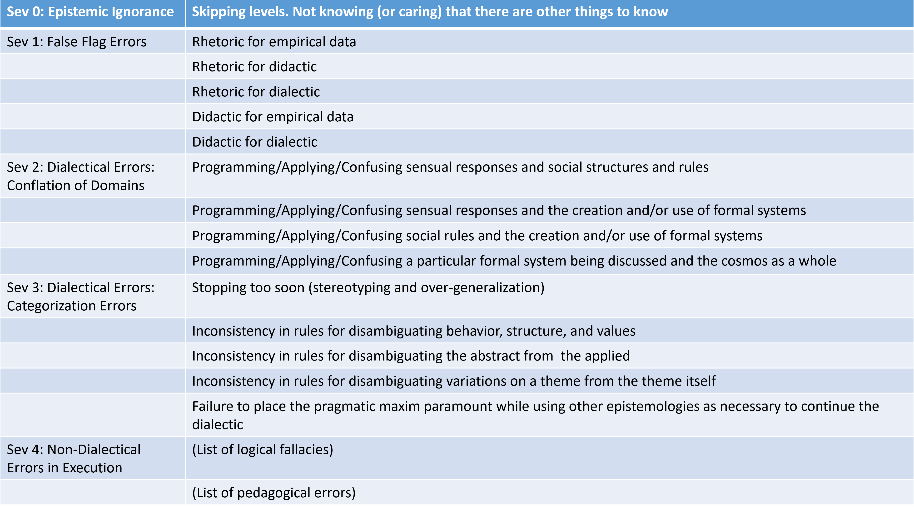
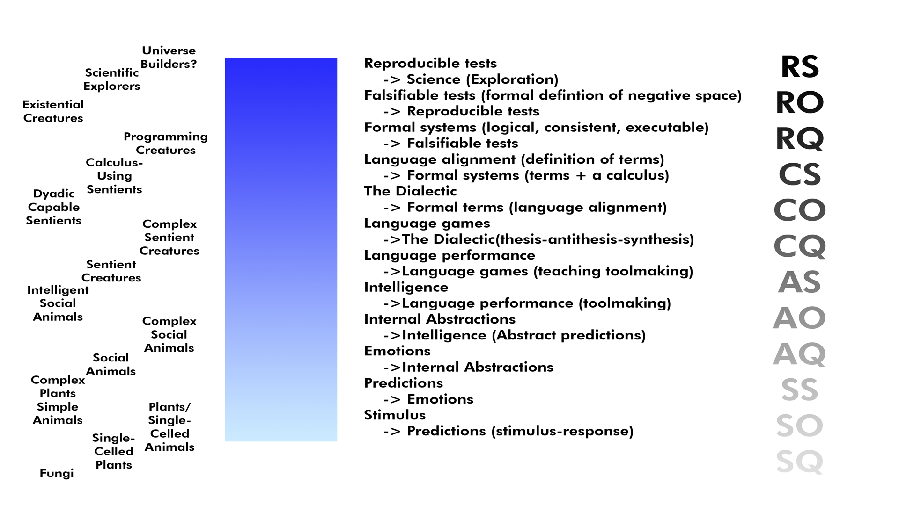

# Learning Through Failures is a Fail

For reasons that can never change, it's impossible to tell somebody that they're wrong without being wrong in some way ourselves. Let's tour the wrongness zoo and find out why.

It happened again. Somebody was wrong on the internet. And when I politely pointed out that they were wrong, I was wrong too, only in ways I could never have anticipated. I was wrong about wrong.

I was wrong about wrong. I bet you're wrong about wrong too.

First, *wrong* is such a simple word to be overloaded so much.

If I postulate x+y=7, then later say that x and y are 5 and 8, those two statements cannot both be true at the same time. Obviously I am wrong. A more precise way of stating things is that I am inconsistent. I think most of the time when we say somebody is wrong, we mean they are being inconsistent with either things they've said previously or things that all people hold to be true.

This is probably the worst way about being wrong about wrong: thinking of human language as if it were geometry. "You said A implies B, and B implies C, so of course A must imply C, right?"

Wrong.  You are confusing two completely different types of communication.

Perhaps "B" in the first context means one thing. The same term "B" might mean a subtly different thing in the second context. Same term "B", different underlying intentions. Language ain't math, and it's never going to be. Language is an art form we all participate in, it's an interactive nuanced performance. We perform human language for one another.

{blockquote}
*’Twas brillig, and the slithy toves       
Did gyre and gimble in the wabe: 
All mimsy were the borogoves,       
And the mome raths outgrabe. 
“Beware the Jabberwock, my son!       
The jaws that bite, the claws that catch! 
Beware the Jubjub bird, and shun       
The frumious Bandersnatch!” 
– Jabberwocky, by Lewis Carroll*
{/blockquote}

Is the text above wrong or right? The question makes no sense, as this is a poem. For this particular style of poetic art (a nonsense poem), the words don't matter, only how the sounds go together.

We have to understand the goal if we're ever able to evaluate if something's wrong or not. Broadly, there are two types of social interactions, math and art.

**Math** just is, it exists with or without people. People can "do" math, and in doing so they can do a terrible job of it, creating inconsistent statements.

**Art** has to have an artist and an audience, even if they're the same person. The artist and audience get together to create some mutual experience: learning, joy, drama, persuasion, tool-making. Math just exists regardless of us humans, art is performed.

If I tried really hard and I were a good actor, I could perform mathematical statements. Using a lot of inflection and body movements, I could stand in front of you and take the same algebraic statements about x and y above and perform them for you such that you receive half-a-dozen different meanings from them. Same math, different language meanings. Math is context-free. Art is all about context.

Here we have our highest-order error about wrongness: failure to understand (or appreciate) the difference between human language and formal systems (algebra, geometry, calculus, category theory, computer programs, etc) You can't logically-reason about conceptual ideas, at least not in order to arrive at some kind of proof. (You can and should use logic for a lot of other things, though! You should be constantly using it! This is not an argument for giving up reason or logic!)

Let's take another look at our Ladder Of Civilization from the books, this time presented bottom-to-top in terms of inferences. On the left we have example lifeforms. On the right we have our nodes. In the middle is a presentation of what depends on what.

At the very top of the list we have science, our light in the darkness and the only thing any species has to explore the universe around them. At the bottom we have the most primitive life imaginable. (I called primitive life fungi. I leave the debate over what the most primitive life is to others) Evolving intelligence advances up the bar, from fungi to things we could never imagine (Multiverse builders? multi-dimensional super-intelligences?)

Hopefully none of the readers are fungi, so emotions are probably the first level on the chart where we all have some shared knowledge.

Study-after-study, along with a plethora of human experience, has shown that emotions come first, decisions and rationalizations later. We decide between fight-or-flight when we first encounter new stimulus. This instinctual decision looks different in different creatures.

If we were badgers, we'd just choose fight or flight and that would be it. But since we're humans, we rationalize whatever choice we've made. Perhaps we debate instead of physically fighting. Instead of taking flight, perhaps we start a conversation using diplomatic pleasantries. The thing to understand is that reasoning doesn't matter at the lowest level of interaction. Many times we choose reason and argumentation only after our first non-intellectual choice is made. I'd argue that most of the history of human progress has been because we understood that humans are primarily instinctual and we've made all of our progress as we kept trying to find ways to work around that fact.

Assuming that we have the same goal, we've come to our first category of being wrong about wrong: skipping levels on the ladder. The ultimate error in identifying wrongness is the failure to understand progress, collapsing the top to the bottom, conflating the laws of the universe with emotion. I feel a certain way, therefore there's nothing to be done. The universe is just like that. I don't have to think about it any further.

Most folks today deny that they skip levels. It's quite painful to understand the true nature of human existence. Much easier talking about it in terms of far-away past, dark ages, tribal human sacrifices, religious wars, or mediums giving séances where people can contact the dead.

Confusing the bottom (emotion) and the top (the universe) might be uncool to admit, but there are a ton of people who use science in place of the universe, conflating science and emotion. I don't like this thing, therefore science tells me it's bad. I will come up with reasons later. Or maybe somebody else will tell me. There could be very complicated reasons. I might not be able to explain them but I know it's true. After all, it's science.

To make our way past this problem we have to fight our own nature. We short-circuit as much thinking as we can and never think any more about it. Energy is precious. Brains are lazy. Survival and passing on genes is the goal, not thinking up stuff. Why won't the car start? Because the universe hates me. We naturally fall back to skipping as many of the levels as we can.

What's the trick to dealing with the fact that we don't like thinking and suck at thinking about things in-depth? For 99% of our history, humans used conversation: language, communication. Our building blocks, then, are the pieces of language performance. We have to categorize language. We stated "assuming we have the same goal", but what are the different goals people have when using language?

Broadly, there are three kinds of goals and associated social interactions we can have involving language: rhetoric, didactic, and dialectic.

**Rhetoric** is communication with intent to persuade. If you've ever watched a courtroom drama on TV, you've watched a lawyer use rhetoric to persuade the jury. If you've ever been to a religious service or watched a person on TV or the internet get angry and rant about something, you've experienced rhetoric. Martin Luther King Jr. was one of the best rhetoricians in the last hundred years. Rhetoric can either be about a good cause or a bad cause, but it's judged on how well it persuades. That's what it's for.

**Didactic** is communication with intent to teach. Anybody who's attended school or watched a YouTube how-to video has experienced didactic communication. There's a teacher and a class. The teacher seeks to instill new abilities and habits in the pupils using various techniques, such as the Socratic Method. Carl Sagan was one of the greatest media didactics in the last hundred years. The skills of being a good teacher are not related to whether you're teaching a good or bad thing, a true or false topic. Didactic is for instilling knowledge into the minds of the audience, it's judged on how well it teaches. That's what it's for.

**Dialectic** is communication with intent to align language or discern truth. The ancient Greeks used a lot of dialectic, walking around in a small social group jointly considering what various things meant or implied. If you've ever watched a good science fiction TV show or movie, you're watching the dialectic. At some point our heroes, using logic, science, and reason, figure out that some of their assumptions about the universe are wrong. That slime mold, it was actually intelligent life! The dialectic doesn't involve true or false, good or bad. It's a group of people coming into alignment on terms such that an action of shared value can occur. We agree that slime mold is intelligent, therefor we're not going to set it on fire. We used the dialectic to explore ourselves and the universe around us and we all ended up in a useful spot we weren't in before. That's what it's for.

Whenever you tell somebody they're wrong, you're using rhetoric. Your goal is to persuade them of their error. Both of you are engaging in the art form of spoken or written language. Both of you have one of these three goals, rhetoric, didactic, or dialectic. 

We know what kinds of communication we're using (language). We know our goals might be (rhetoric, didactic, or dialectic). We have context. We can talk about wrong or right, otherwise the word "wrong" doesn't have enough context to make any sense.

The worst mistake was skipping levels, so skipping levels constitutes our Sev 0 errors about wrongness. Now we can now set up a categorization system for identifying bugs in our error-detection systems.

## Sev 0: Epistemic Ignorance

*You don't know that there are living-language-learning interaction levels.*

Epistemology is the study of knowing things. How do we know things? What does it mean when we say we know something? It involves everything you would expect: sourcing, justification, fideism, and so forth.

Epistemic ignorance is not simply not-knowing something; that's just ignorance. Epistemic ignorance is not knowing (or caring) that there are things to know.

{blockquote}
Dear Sir,

This is in reply to my complaint email. I told you that your "Acme Surefire Roadrunner-Catching Kit" which included paint, a balloon, and an anvil, did not work.

You replied that I had not received adequate training. I should watch some of the free online webinars in how to use the kit.

You are wrong sir!

Every day something bad happens to me. I fall off cliffs, I run into canyon walls, I blow myself up. In my mind, I have consulted with the Great Pumpkin, ruler of the universe. Now I understand that this is just the way life is going to be for me. No coyote anywhere will ever be able to catch any roadrunner. It is forbidden. Therefore I expect a full refund on all the money I paid.

Sincerely,

Wile E. Coyote
{/blockquote}

*(The Acme guy may be correct, the coyote may actually just need more training. Or the coyote might be correct, perhaps the universe is always going to screw him over. Who's correct or not isn't our point. By ignoring all the other levels of living-language-learning, the coyote has called out the error in a way that is impossible to deal with. He knows something is wrong, but he doesn't know what type of thing is wrong. He thinks it's just the way the universe is. It's just wrong. He has no error-identification and classification system.)*

If a clown kicks the same dog every day for four years, then the dog sees a similar clown and bites him, do you proclaim that the the dog is wrong? Of course not. That would be applying levels of mutual cognizance to the interaction that are simply not appropriate. You're being wrong when you proclaim the type of wrongness you see. Once again, it doesn't matter who is wrong or right. We're talking about figuring out what kind of error you have before communicating it.

Some examples:
- Einstein saying "God doesn't play dice with the universe". It's a great quote, and it captures succinctly his point, but he is correcting colleagues in a way that there is no response to. What could they say, that god actually plays a lot of dice?
- A doctor explains to a family that a certain kind of medical procedure is required for their child to save their life. The procedure only has a 10% chance of succeeding. They decide to trust in their faith instead of getting the procedure
- An old man, feeling badly about an argument decades ago, sets off on a journey of hundreds of miles on his riding lawnmower in order to apologize
- Troops in dire mortal combat, responding to religious sights and sounds of their youth, stop fighting and celebrate a shared religious holiday, then return to fighting
- The largely apocryphal story of Hernán Cortés landing in the New World and burning his boats so that his men knew there would be no retreat. They survived here or died.

In many cases, instinct, gut feelings, and deliberate faith are wonderful things to go on. In almost all areas of life, we don't use all of those intermediary levels between emotion and our conception of the universe anyway. I see my dog, I'm happy. He's happy. We don't need to sit down and start doing syllogisms for that. Collapsing things to their simplest essence can be beautiful.

Remember, the point isn't whether logic or reason works or not. The point isn't who's more correct or not. The point is that you can't correct a logic error for somebody not using logic. Whether they know they're acting on instinct or not, they are, and there's nothing to do. We don't correct instinct.
Epistemic ignorance may be great art, but it is a fatal error for any mutual learning system, i.e. dialectic. The coyote and Acme guy are never going to work it out. That's why these errors-in-error categorization are categorized Sev 0.

Epistemic ignorance may be great art, but it is a fatal error for any mutual learning system, i.e. dialectic. The coyote and Acme guy are never going to work it out. That's why these errors-in-error categorization are categorized Sev 0.

## Sev 1: False Flag Errors

*The purpose in your mind for your living-language-learning interaction and the purpose in their minds are different.*

We've established that when we tell somebody they're wrong we're not checking their math. We've established that didactic and rhetoric are wonderful tools, but if we're getting together to find truth and align our language/terms, we're using the dialectic.

In most of our experiences, these three types of communication happen at the same time. A teenager asks for the car keys, explaining how such great parents as you guys would obviously see the benefit in giving the car to them tonight (rhetoric). In return, and as sort of a perverse form of tribute, the parent may give a ten-minute lecture on the evils of dangerous driving (didactic). There may follow a five-minute argument on who was at fault for the fender-bender that happened in the family car last month (back to rhetoric). Finally, there could be a ten-minute family discussion, with both sides being open-minded and trying to learn, about what it means to be conscientious while driving with a peer group you desperately want to impress (dialectic).

For our imaginary family discussion, they don't know or care about the names of these goals. To them, most likely, they're just having an honest conversation using logic and reason about the disposition of the car this evening. Nobody distinguishes the constant movement we do between these various kinds of conversation because nobody has to. But for many professionals, such as lawyers, public speakers, some kinds of internet celebrities, these are completely different things and mastering them means the difference between success and failure at their job.

Most times for us regular folks it doesn't matter. Sometimes, though, it does.

 {blockquote}
 Dear Gustoff, Village Leader In Charge Of Angry Mobs

This is in reply to your email from last week. I was very clear. You have unfairly accused my mom of being a witch. This resulted in her death and caused a great hardship on our family

You replied that there had been a fair trial, conducted by no other than the famous Sir Bedevere The Wise, Knight Of The Round Table and Adjudicator Of All Scientific Matters, found her guilty and gave her a fair sentence. You pointed out that even she agreed the sentence was just. She did weigh as much as a duck, clearly indicating she was made of wood and therefor a witch.You, sir, are wrong!

Feathers also float, as do small bits of bread. The great tome of Toledo tells us that witches can also be made out of butterflies. You're a bad person who never liked my mom. And that scale doesn't even look like it could work!

 Sincerely,Carrot-Nosed Kid Who Is Also Not A Witch
{/blockquote}

*(The logic here and in the accompanying movie clip is atrocious. Our email writer makes one logical fallacy after another as he points out what's wrong. But that's not his worst mistake! His mistake is not understanding the thing he's criticizing, the original scene. 
Bedevere "teaches" the angry mob about the correct way to spot witches. Bedevere is appearing to be a teacher. Engaging in didactic, especially if the teacher is good, is a wonderful experience for the entire audience. He's asking questions back-and-forth with the crowd, as if they're all on a journey to "discover" whether she's a witch or not. He appears to be helping them. But what in fact he's doing is rhetoric: he's persuading the mob of his greatness and authority in all matters of science. The actual science or underlying reasons have nothing to do with anything. 

Our email writer will never ever get anywhere, poor logic or not, if he continues to attempt to use logic in a discussion that involves rhetoric. What Bevedere is actually doing and what he appears to be doing are two entirely separate things, whether Bedevere realizes it or not.  The Pythons knew this. There's a wonderful punchline at the end, where Bevedere has done such a great job of persuasion that the accused herself actually agrees she's probably a witch)*

Professionals master all three skills, and for maximum effect they never point out which one they're using at any given time. Keeping an audience unawares, a good speaker can smoothly switch from educating the audience about history, asking them questions from their own person experience, and strongly advocating some preconceived point. This is the way all public discourse works. (It's also what made Socrates very angry, but that's a story for another day)

Listeners enjoy these performances and respond by continuing to imitate the performer in their own interactions, conflating things as needed to achieve whatever goals they have.

Some examples:

- The sneaky used-car salesman who offers to take a young couple into his office so that they can do some math and see if they can afford the car. To the couple, he's doing simple math. He also being kind enough to teach them some about how to budget their finances. To the salesman, he is using rhetoric to persuade them to buy a car. In his rhetoric, he is purposefully confusing the listeners as to his true goals
- The book writer who is writing a book about how ancient aliens gave all of the technology to us that we have today. To the reader, the author is presenting a clear case of various factual things that most people agree on. He presents a logical case so sound that there can only be one conclusion: we were visited by aliens and they gave us all out technology. To the writer, however, whether he knows it or not, he's cherry-picking all sorts of half-understood things from history and drawing suppositions that appear to connect them. In his mind he also may just be using reason and logic, attempting to teach an important thing he's figured out. But the real goal is rhetoric
- A teacher sets up a "debate" between students on a topic they want to teach. Encouraging both students to make the best case they can, the teacher while appearing to referee the debate actually conveys the selected course material to the class
- A startup grows to the point that the coders decide to write down some coding standards. A long email discussion follows which different developers get quite passionate about whether to require tabs or spaces. Each developer creates a document full of links to research, books, and blogs to support their position. Since each side is "right", they see no need to discuss the matter until the other side accepts their error. They're trying to use math and rhetoric to take the place of the dialectic. While both may very well be required by the group as supporting documentation, in the end, an agreement on terms and standards is for many things is quite arbitrary

In a big way, false flag errors are an intellectual sucker punch.

When you're correcting somebody using a false flag premise, either of you may be engaging in this behavior deliberately or by accident, making it even more difficult to remedy. There are a lot of people in the world thinking they're just using "simple logic" when in fact they're making rhetorical arguments. They don't know better. You can't correct somebody if they don't even know what they're doing.

If you can't identify what's happening you have no chance of fixing it. That's what makes it so pernicious.

Sev 1 error identification bugs are fatal to any current or future interaction. There's nowhere for both of you to go together if you're going in different directions.

## Sev 2: Dialectical Conflation of Domains

*You're trying to solve a problem in one living-language-learning level that exists in another.*

If we're clear on why we're interacting, and it's for our mutual benefit, the next category of errors involve mixing up one level of our ladder with another one. The good news is that we're beginning to enter territory where we can make an error calling out an error and still have a recovery and successful conclusion. The bad news is that Sev 2 bugs are notoriously difficult to sort out.

Dialectical Conflation of Domain bugs in error-spotting are when you apply the rules and thinking patterns of one level of the Ladder of Civilization to other ones by announcing the ones in-between are unimportant.

*

What if you're smelly or really rude? What if you can't make a complete sentence without being crass, vulgar, ugly, racist, rude, misogynist, and so forth. Perhaps your body odor is so bad that people can't stand to be around you. You make a mistake. I respond by saying "You're wrong! I don't have to put up with abuse like this! I can't engage in any useful discourse with somebody as disgusting as you!"

Let's face it, in announcing your error, I'm not wrong. We cannot continue. Something must be done.

Once again, though, my identification of your error is itself in error. I'm confusing sensual and social stimulae with intellectual ideas. Your smelling bad, or your being disgustingly rude, are indeed ways of shutting down our conversation, but none of that has a damned thing to do with our topic of discussion. I'm mixing up your being sensually or socially wrong (having some condition of the physique or personality, innate or intentional) with your being intellectually wrong.

Smelly people have important things to say. We fix wrongness in each of these levels by addressing things at that level. Dealing with smelly people may involve plugging our noses up. Dealing with obnoxious people may involve strict group norms. These are all wrongs that need to be righted, no doubt, but these problems have nothing to do with our goals. Trying to take a social hammer to drive an intellectual nail in is itself wrong. Whether accidentally or on-purpose, we're conflating dialectical domains.

These errors and error categorization problems can be recovered from, and it's the job of good conversant to be able to do this. It's not always a sure-fire thing, though. I wish I had magic fairy dust to offer for those trying to do it. I do not. Such error identification and error correction conversations are minefields.

## Sev 3: Dialectical Execution Errors

You're doing the living-language-learning work wrong.
Dialectical Categorization Errors occur when you're in a spot to make great progress using the dialectic with other folks in some social group, but you're executing the work of the dialectic poorly.

Remember that the purpose of the dialectic is to come into alignment on terms, language. This is usually done by participants making broad statements using stereotypes and generalizations, then the group as a whole narrowing down those generalizations to some specific set of terms they all can agree on.

It has to be that because we all come into the discussion with various abstractions of various levels and various words to describe those abstractions. Good dialectics resolve that, or at least resolve it as much as required for a formal system of logical, consistent, and executable falsifiable tests to be constructed.

There's an old joke that most programming jobs begin with specifications so ludicrous as to be absurd "Do more good stuff" might be the start of a project.

[*(Software developers are very familiar with the various ways technology teams can get screwed over by the organization. The vast majority of these are either Sev 2 bugs or the results of them)*](resources/images/wrong-about-wrong-tom-takes-requirements.png)

Some companies have project owners walled-off from coders. It's a tedious chore having conversations, so everybody tries to have as little as possible. Or a false gated-schedule is set up, where certain kinds of conversations only happen at certain times. The dialectic can't be natural, and without a natural ebb-and-flow of human interaction, it's not a dialectic at all. It's some advanced form of order-taking.

Good projects have a dialectic that continues throughout all of development and deployment. They have a lot of these Sev 3 errors that come up, but the project recognizes them and quickly recovers. Bad projects have requirements. Don't have a Tom.

*Dialectical execution errors happen constantly and good social groups are able to recognize and recover from them with no time or energy lost. Bad social groups may not even be able to recognize them as they happen.*

## Sev 4: Non-Dialectical Execution Errors

*You've made some craftsmanship errors in the work you're doing.*

Finally, we have the errors we make in other forms of interaction that can directly affect our ability to spot wrongness. There's a list of logical fallacies you might be familiar with. There are various lists of pedagogical mistakes that can be made. (Pedagogy is the study of teaching)

A programming error, for instance, is a non-dialectical error. Is that a feature or a bug? Putting a feature into a bug-tracking system is an example of a error identification mistake that involves no social interaction (rhetoric, didactic, dialectic)

> *Once you eliminate the impossible, whatever remains, no matter how improbable, must be the truth. – Sherlock Holmes*

*(This logical fallacy is so popular it even has its own wiki entry on the rational wiki. Logical fallacies are used in everyday life. Simply because somebody uses a logical fallacy doesn't mean their conclusion is wrong, that's a fallacy in itself, "argument from fallacy".  Instead of being useful at proving right or wrong, as long as we share a common goal, fallacies are a necessary part of identifying where further language alignment is needed. That's called a "fallacy fork" Testing out and trying terms and propositions is the actual work of the dialectic)*

Instead of thinking of them as errors, they're much better considered as the actual work.

These are the errors everybody talks about. I'll leave these for another author.

## Conclusion: You're Stuck. It's Work

We've ran out of categories, and we still haven't defined wrong yet.

Is there no way out of this conundrum? It seems we are in a trap of our own making, and indeed we are. For reasons we can never change, it's impossible to tell somebody they're wrong without being wrong in some way ourselves in doing so.

Why must that be true?

We will always be wrong when telling somebody that they're wrong because we're providing a boolean response to something that can't take a boolean. Human languages are squishy, malleable. They constantly change and words can mean anything. In fact, in a great many cases where we think somebody is in error, we have different ideas about what the same words mean. When we give up that exploration of language differences and expect human interaction to work like a printed geometric proof on a page, we're trying to use a tool in a place where that tool will never sufficiently work. Yeah, the hammer will get the screw in a little ways, and we can feel good about it, but it'll never do the real job of a screwdriver.

Ever watch physicists online engage in commenting about some news-of-the-day? One physicist might say that the news is overblown, but the underlying concepts are good. Then they'll go to some length explaining the underlying concepts. Another might say that no, the article itself is wrong and the first physicist either doesn't have a good grasp on the underlying concepts or is mistaken. A third might weigh in that both are right in various fashions, but there's a third domain implicated that neither of the first two have considered.

I love watching smart people talk about their work. I also love watching children learn to speak. Ever watch two-year-olds engage in some discussion over a topic, such as who gets the icy pop? These things usually quickly devolve to something like "Mine! Mine! Mine!" and "Boogerhead!", followed quickly by "Mom! He called me a boogerhead!"

These are two examples of the same thing, humans using language, interacting, grasping for knowledge, control, and power. They're engaging in dialectics, no matter how primitive. The children will come to a better definition of what the term "mine" means. The physicists will come to a better definition of what (perhaps) causality means in a quantum multiverse. The only difference is that the physicists are working at the top of the bar and the two-year-olds much further towards the bottom.

Assuming we're doing the dialectic, trying to have productive interactions to make us all better people, we're all headed to the same spot at the top: reproducible tests. To get there there's a list of prerequisites that have to be done. At each stage, all of us get things right and all of us make errors. In a big way, no matter what we do we're always in error until we get to the top, and even then we're not quite sure if we're right or not. Is that scientist wrong for espousing String Theory? If so, is that the same kind of wrong as the guy who said that The Great Pumpkin told him that Summer Squash will take over the Earth one day? How do I tell each of these people they're wrong in a way where I don't make their errors worse and lead us both down a path we'll never recover from?

Now we have a working map. That gives us a better job description. Now we can start talking about answers.

