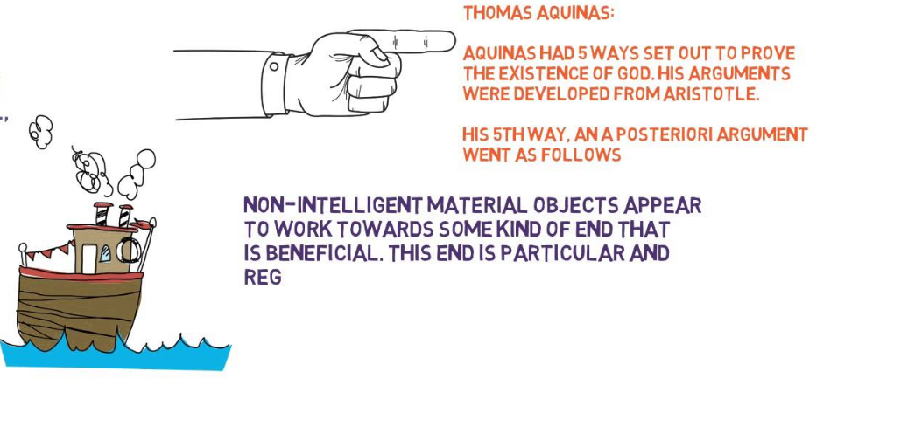
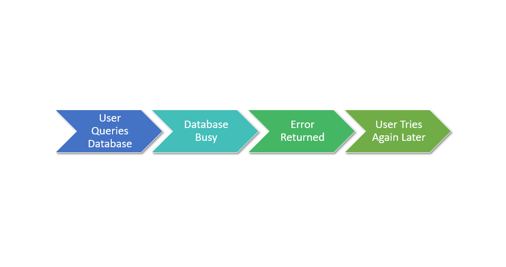
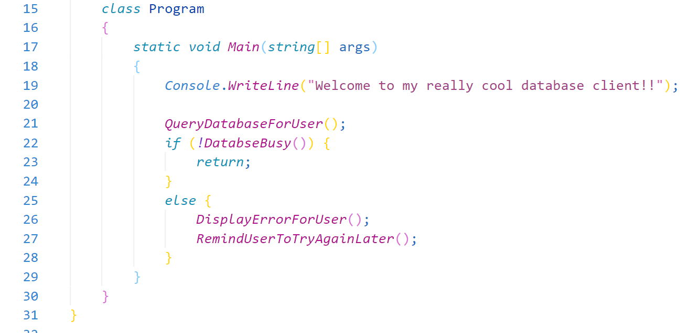
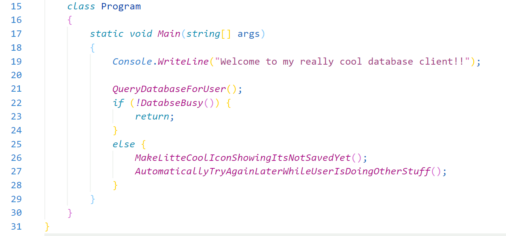
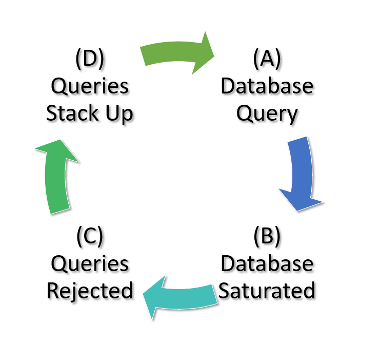
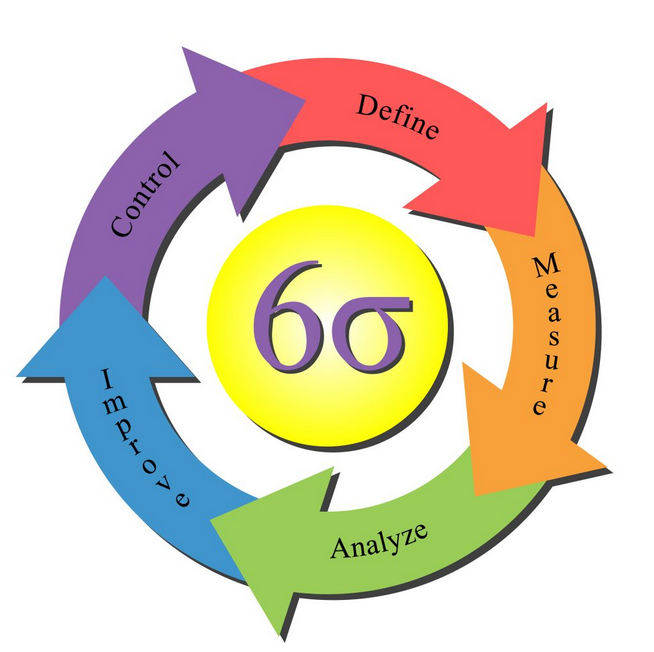
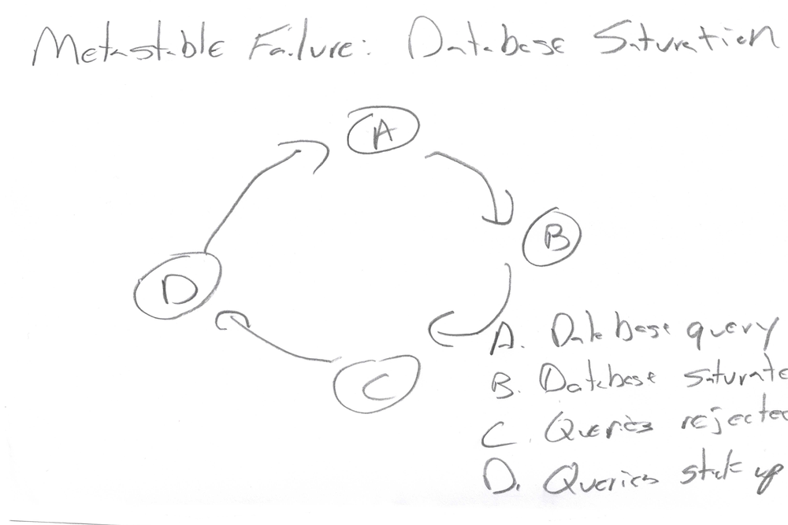
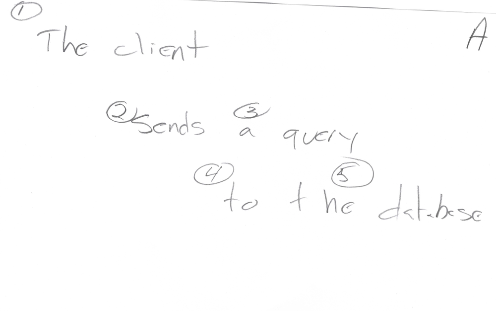
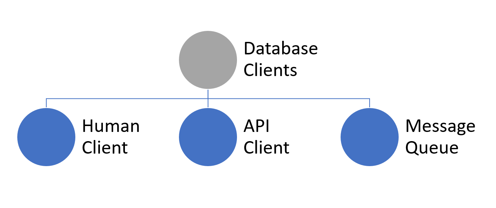
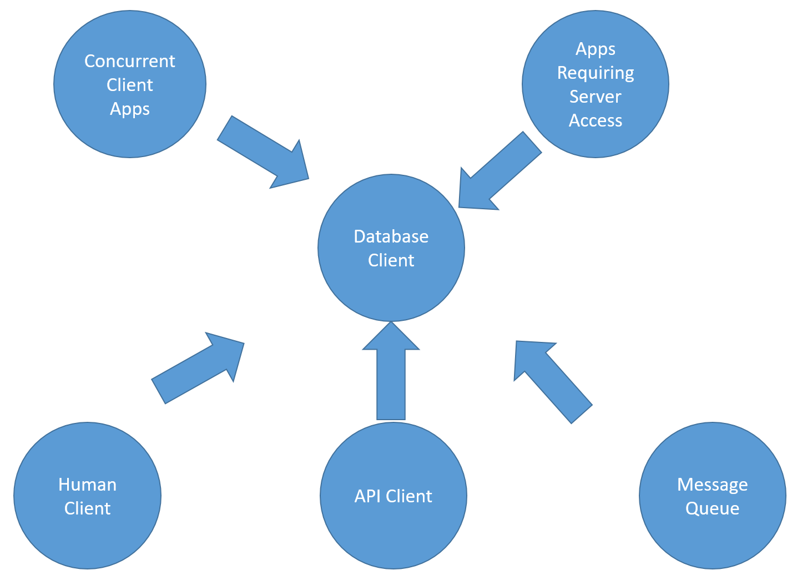

# Learning Doesn't Work Through Feedback Loops

***The phrase "feedback loop" is total bullshit. We're all going to have to keep using it anyway. Here's why.***

We make a lot of bad decisions in organization and system design because of the way our heads are shaped. It's not our fault, but to fix it we have to understand it.

I have been using the phrase "feedback loop" for my entire career. An immature way to look at the world, simplifying as much as humanly possible, is in terms of cause and effect. We do A, doing A makes B happen. It's so simple that it's built into all lifeforms. Plants grow one way, they get more sun. Every now and then, herd creatures like deer or meerkats stop what they're doing, pop their heads up, and look for predators.

There's no programming language or master plan required for this. Thing A happens. It makes thing B happen. Over time lifeforms that embrace A->B in certain environments breed better than those who don't.

When we observe, make notes, talk about, and study things around us, we think in the same format. It's not surprising. Various things in life are just strings of causality; D->E->G->H. Our job as natural philosophers and scientists is simply categorizing those things and events, then describing the various chains that we've categorized.

This works very well for many people and is our default way of talking about the world. It worked for mankind as a whole for tens of thousands of years, up until just relatively recently. But over time, as various species went extinct, the weather was found to be different from place-to-place, risk was understood as a separate concept among populations than individual, we began to realize that in some systems many things happen in cycles. The rain brings plants and ponds, ponds evaporate water into the sky, water in the sky brings rain. It's a cycle, not a straight line.

Things are all interlocked. Many scientists and philosophers stopped talking about cause and effect and started talking about systems of things. We don't have a forest; we have an ecosystem. Things we do to one plant affect other plants and animals, and eventually down the road the end result of all of that causality directly affects. We live in a cycle with everything around us, whether biological or otherwise. The universe is full of all kinds of interlocking systems.

In fact, the more we looked at it, the more we realized that there never was really any such thing as cause and effect, it was simply a useful fiction. "No man is an island" is a catchy phrase used to describe that. As far as we know, every atom in the universe is gravitationally affected by every other atom. Cause and effect just isn't dead. We use cause and effect as a prop, an intellectual crutch. It's a child's tale told in order not to spend your life diving deep into things that don't matter to you. A fable. It's a useful fiction. Or, if you prefer, cause and effect do exist, it just exists among billions of interlocking variables spread out over creation. It's non-comprehensible. We are forced to use cause and effect because we can't process things otherwise.

But isn't there a better way to represent the world around us? Isn't there some way we can talk to others about how somethings cause other things that then feed off of one another? It turns out there is, and things that feed on themselves have been represented for a long time by the circle.

As humans emerge from babies to adults, as mankind emerges from the dim mists of time to modern man, we stop thinking of simply cause and effect and start thinking about loops. Early religions were almost all circular. As the Cylons said on Battlestar Galactica, all of this has happened before. It will happen again. It's impossible to ignore: there's something deeply mystical about circular relationship.

Which brings us to feedback loops.

## The Classic Loop

Let's take a look at a user asking the database for something, but the database is broken. Almost everybody who has learned to program was told that programming was "making a list of things for the computer to do". It looks like this.

You could almost write this directly to code, at least if you're using an imperative language.

Of course, there's no code here, but it represents a very simple idea. "Query the database. If it's busy, do it later". In fact, instead of asking the use to ask again later, we can just automate that.

Even though everything looks brutally simple, facile even, and we're doing something almost every programmer since the Univac has done, we've actually actually stumbled into a really interesting new concept that humans haven't really explored that much because up until the last hundred of years or so we've lacked the ability to create vastly-complex systems of logic: the Metastable Failure.

The problem is that if the database can service the query because its busy servicing a bunch of other queries, not only does it fail for you, because it has this huge stack of work to do that's only getting bigger, it's always going to fail. As a programmer you didn't do anything wrong. The database is not in error or broken in any way. But the entire system is failing and is in a stable state such that it will never recover.

Loops and circles to the rescue! To describe and reason about this particular metastable failure,  let's put this situation into a loop, a Feedback Loop.

Once we started looking, we found these loops in all kinds of places, not just programming. Between feedback loops and systems, we've got all of modern science covered.

## It Gets Complicated

If you remember when we talked about Boyd and management theory, I mentioned that once he created his OODA loop, as he studied and looked into things further, the image got more and more complicated.

![The more Boyd dug into things, the more he realized that everything affects everything else, including all of the items in his diagram! Once you start mapping that, you realize that other things affect those things, and so on, ad infinitum. Intellectual work is infinitely divisible. [math and other physical systems, however, are decomposable]](resources/images/OODA.Boyd.svg)

Let's take our metastable database problem and analyze it a little further. Let's say we were sketching this problem out, as if we were trying to solve it using a napkin.

There's our loop. Let's take each node and write it out as a sentence.

Notice that I've not only written each node as a sentence, I've also broken the sentence up into what I consider to be meaningful chunks. Other folks might have other sentences or break them up differently. That's fine. The details here are not important. We're talking about process. Whichever choices others make, they're going to end up in the same spot we do.
Adding Detail To Our Example Spec

Here we have our client, the person who wants to query the database. We even have a little icon and everything! [insert more warnings here about how graphical tools tend to lock you down to one way of looking at things]

But wait, is "database client" really a person? Database clients can be anything, right?

Well hell, that's great, we've taken the little icon of the person out, but it really doesn't haven't learned anything. The purpose of sketching things out is to understand problems in order to solve them. What kind of client? When do they use the database? We need more detail, so let's add some.

It's a database client. For starters, let's say there are three major kinds of database clients: human client, API client, and message queue.

That tells me how the actors relate to being a client, but how does a client relate to other things in the system?

Now we're getting somewhere! A client is one of many different types of client apps. It's also one of many different types of apps needing database access.
The problem is that this is all wrong.
Why Wrong?
By sketching out how things relate to one another, no matter how careful we are we start to introduce unneeded context. If it's just one or two of us kicking around, it doesn't matter. If it's just a few of us creating a app for a customer, it might matter a bit but not that much.
A database client is a type of client app? It's a concurrent app? Those top two arrows are backwards, right? What happened to our little picture of the person? The person wouldn't just be in that one spot. People can ssh in to servers locally and run queries. They can cron up queries. People should be all over the place, because after all, aren't we really talking about what people are doing and what they want? If my database query fails over a web client and I automate the resubmit using cron, I have no spot in this picture.
Well hell, Daniel, you might say, we've got that modeled. There are three major kinds of database clients: human client, API client, and message queue, remember? It's simply that the model is in error. Perhaps if we continued to add more detail we could fix it.
Not only is that wrong, if you head down this path you're going to end up drawing complex, intricate diagrams that nobody, including yourself, fully understand. We only have six nodes in our graph and already we've created something that we cannot completely agree with. That ambiguity and the associated unease can easily lead us to create even more things in our diagram. People make mistakes, create inconsistencies, whenever they write things down. Writing more things down not only does not fix it, it makes the problem worse since it becomes more and more non-obvious where any problems are. Plus we're creating more and more things that can be inconsistent. Remember, we were only looking at one node, on one card, in one loop, in pseudo code. That's as high level and simple as we can make it.
We need another method, some new way of thinking. Let's try this a different way, adding probabilities instead of rigid logical relationships.

Now the graph isn't necessarily in error. We don't know who the exact database client might be. We're guessing.
It's extremely important to understand that although this graph uses the same symbols and drawing methodology as the first one, this is an entirely different kind of thing. Up until now, we've been trying to model out things as rigid mathematical concepts. That's why there's no end to it. Now, however, we're just throwing together a bunch of things we're guessing about. Call it a "Probability Web".
Dang You, Math!
You might be seeing where this is heading. Markov Chains.

Things relating to one another based on probabilities are a type of Markov Chain. It's the basis of all Artificial Intelligence (AI) today, and there are dozens of books worth of material you can explore if you're interested. For now, all we care about is that Probability Webs are different in fundamental and completely incompatible ways from rigidly structured symbolic relationships, such as flowcharts, class diagrams, org charts, or computer code.
The most important way that they're different is that a chunk of symbolic structure, let's call it "math", can be done. In fact, it's always done. You code for a bit. Once you stop coding, you have a chunk of rigidly structured symbols [self-modifying code jocks, we'll get back to you]. You go home. You've created a rigid structure in code that will be exactly the same when you come back tomorrow. If you were a brick mason, you'd go home knowing that the wall you made today will be exactly the same tomorrow. You can start planning on how you're going to add to it.
In comparison, Probability Webs are not like that. Probability Webs are never done. Although we have a fixed number of symbols in our database client example, it's understood and expected that each of those symbols exist in a web with a bunch more. As new data comes in, the probabilities are updated, nodes are added, modified, or deleted. Although we like to explain and refer to these things as webs, we're really not building the webs, we're building the spiders. To reason about these things, we cheat. Only important, mostly-likely relations can be displayed in a graph like we have because otherwise it would be infinite. The snake eats its tail, not only in a simple loop, but in quintillions of loops all throughout the billions of nodes.
We can display parts of probability webs, but if they continue to operate, we can never fully comprehend them. They are not structured in a way to allow simple conversation or diagramming.

It's the Shape Of Your Head
As humans, we have but one mouth. That mouth produces sounds and tones, either in chunks or in clusters. Put simply, we have a simple tone, a simple way of modifying it, and a simple way of joining them all together. If a complex diagram representing Probability Webs can't tell us what something is, no matter how complicated we make it, we have no chance at all of using our speech to convey that from one person to the other.

Would words or some sort of diagramming work? No, and for the same reasons. These are linear, at most 3-5 dimensional tools trying to represent billion-dimension graphs.

Even the Probability Web itself doesn't know what it is, because as it begins to traverse the web, it's continuing to modify all of the connections. The model as it was when it began will not be the model when it ends. It's a completely different universe than we live in.
Brains, Reality, and Webs
Except brains. Brains only exist to process reality, and reality is a bunch of really complex concepts all related in probabilistic ways.
Here all of our concepts join up:
Reality is multivariate, not simple concepts
Reality exists as a web of things related by probability
We can never fully understand probability webs (although we constantly understand them "enough")
Our brains operate in roughly the same kind of Probability Web that reality does. Yay evolution.
When information leaves one of us to be shared with others, it's always in a single-channel, linear format
This format does not match up with the universe as we understand it
Ergo, reality will never be something we can completely diagram in a rigid way. Instead, we're always coming up with just good enough little graphs of ideas in our heads that work right now
Feedback Loops Are Bullshit
It is very easy to diagram something. Once we do that, it is also very easy, perhaps automatic, to convince ourselves that we are done, we have diagrammed it completely. It's axiomatic that this is not true. Therefore, in ways we do not understand, the things we diagram must be incorrect. Perhaps it's incorrect in trivial ways. Perhaps not. But since we're using a Probability Web ourselves internal to come up with these models, we'll never know. The best we can do is come up with something, run it for a while, and adjust it when we finally understand how it's broken. [remember we have an exception for math and physics]

And it's worse than that, because the more we think of our modeled concepts as being rigid, like we did when we thought of "database client" as simply a person, the more likely we are to be wrong in important ways. We're always wrong, of course, but our idea that the concepts we create are fixed make us more wrong and less likely to change our ways. This increases exponentially with the size of the model. For anything based on human communication, the more you try to decompose the meaning of something, the more pieces you have in your hand that need further decomposing. It doesn't work like that.  [with the exception of math and physics]
Instead of feedback loops, here is what we need: Feedback Webs.
Yet Here We Are
But we're still human, and we still only have speech and writing to represent concepts. So like Plato's Cave, or a two-dimensional projection of a tesseract, we have to snapshot or project some kind of half-assed idea in order to get anywhere at all. We have to lie about reality in order to get it into terms we can usefully discuss. Because heads.
We can play around with Feedback Webs in the small, using less than a dozen or so items to start conversations, but they're just that: conversation enablers. We can use more rigid structures like Feedback Loops in the large, perhaps showing dozens or hundreds of things all related in complex ways, but these are so wrong as to almost be farcical [Again, there's an exception for physical systems. We're talking our representation of concepts. Pure math and physics exist context-free. Everything else doesn't]
The best use I've found for more complicated diagrams like the above are road maps: they might or might not lead me to a "neighborhood" with a half-dozen or so concepts that we can then reason about together as Probability Webs. Oddly, though, what we usually end up doing when we're done is "firming up" that structure and then trying to make sense of that with the larger model.
This is a process that will never work. Or as some coders have finally realized, you will never have your Enterprise Model. There's some multivariate super-dimensional probability model that represents your enterprise that you could never understand, but it's constantly-changing and understood differently for all of the participants anyway, so even if you grew a twenty-ton brain, it doesn't matter. It doesn't work like that.
This leaves us stuck using flowcharts, class diagrams, feedback loops and the rest. But the real action is with Feedback Webs. Like our database diagrams, the situation, the things we have to work with, are both solid and amorphous at the same time, depending on the level of detail you're using. If we're going to study learning at scale Probability Webs are the wet clay we use to bake into houses to build bigger structures. These are our bricks. Now we can get building.

## We Have To Watch The Infinities
Everything we do with foundations is going to bump up against infinities. We need to be constantly mindful that we can describe the general process, the general structure, and the general goal, but we could never provide the specifics, as all of these vary based on participants, context, history, and so forth. This doesn't mean we won't have a lot of interesting and useful things to say, but it means that for each thing we cover, we're going to have to note the rules that create and drive the infinity, go over a few examples, then back off. Otherwise we'll end up with one of those nuclear missile diagrams all of us so fear.

