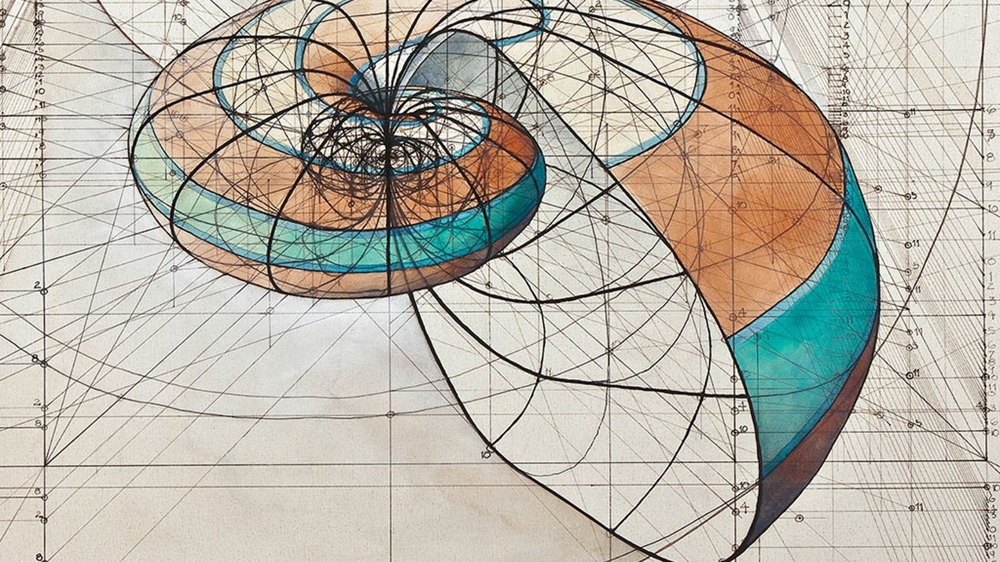
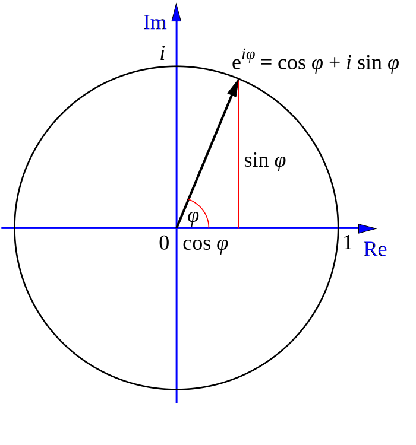
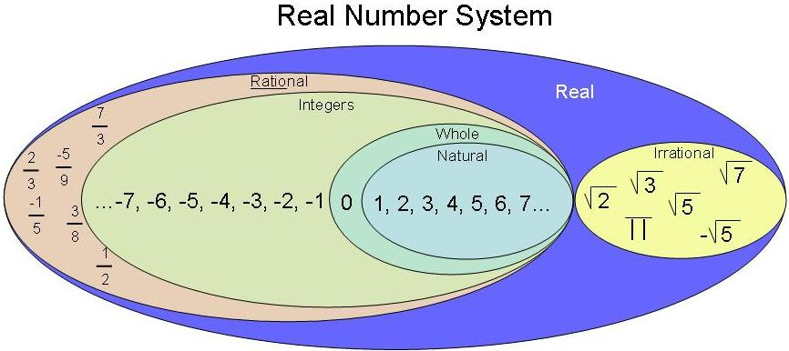
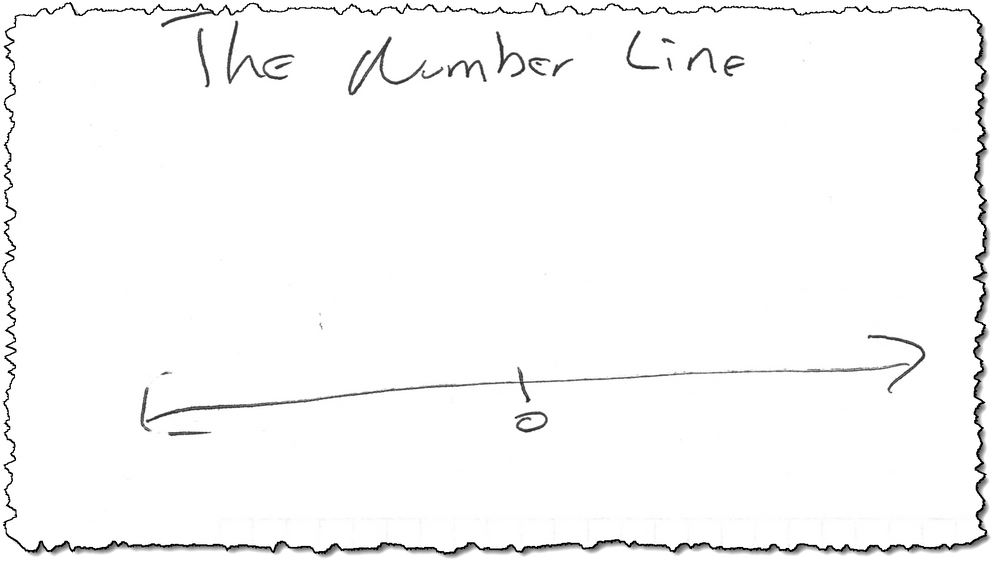
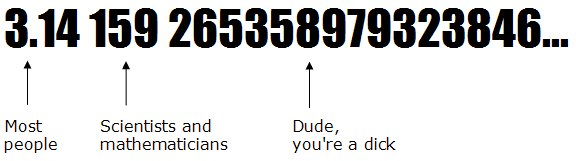
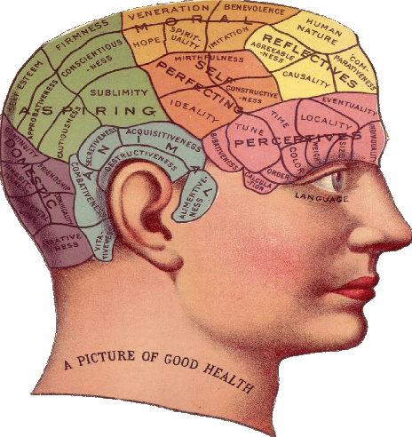
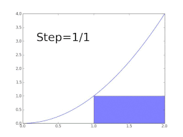
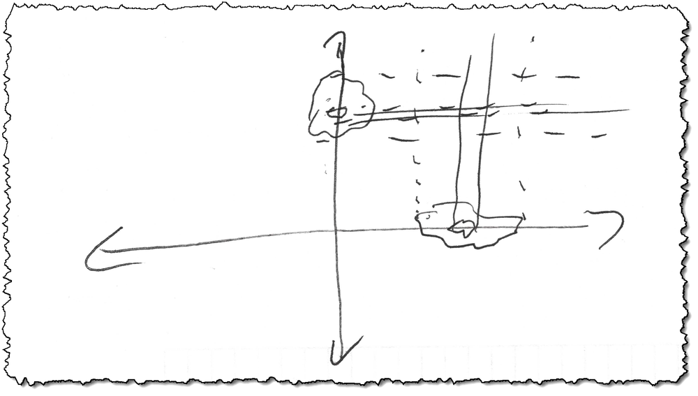

# Negatives Stack, Positives Don't. The Number Line Model of Communication

*An extended metaphor shining light on the problem of having to use humans in groups to agree on things that eventually need to be coded into a formal system.*

{width: 66%}

Do you know about pi (π)? π is the ratio of a circle's circumference to its diameter. This ratio is the same for any circle. Pi is a neat little number most kids learn about in school. People have known about it for thousands of years, ever since we started drawing circles and doing math with them.

{width: 66%}

Here's a fun game: ask a friend what pi is.  Some people will say "3". Many have learned that π is the ratio 22/7. Still others, probably the kids who think they're smart, will say "3.14". If you were to ever ask me, ever since I was a little kid, I'd tell you that it is "3.141592863". That's because I tend to be a pretentious jerk who found things like this impressive, but I only learned that about myself as I got older. At the time, I thought it was pretty cool to know that many digits. I have many friends that know π  out to 10, 50, even 100 or more digits. What can I say? We usually had no problem picking up the girls at parties. It's a gift.

{width: 66%}

π is what's called an irrational number. Technically irrational numbers are those numbers which are not rational. (Mathematicians get paid for saying such things!) Rational numbers can be expressed as p/q, like 4/1, 2/3, or 19/28. You can also express any rational number as a couple of fractions banged together with an arithmetic operator, like 1/2 + 1/4, or 33/17 * 3/17, because math. If you can't express a number as a ratio of numbers, or a combination of ratios, then by definition it's not rational. It's still a number, or course, and it still exists on the number line. So where is it?

{width: 66%}

If you drew a number line, you could point to a specific location and say "this is two", but you can't point to a location and say "this is π". You might get pretty close. Sure, you might get close enough that nobody cares that you're off, but you'll never, ever have an integer number line where you can point to an irrational number and exactly nail where it is. One way of thinking of irrational numbers is that they exist "between" all the rational numbers we can construct and identify on the number line we all know and love. (In fact, for any two rational numbers, there are an infinite number of irrational numbers between the two. As it turns out, the integers and the rational numbers are probably much more ephemeral and non-existent than the irrationals, rationals are scattered like tiny little specks of a diamond on a beach full of sand, but that's a story for another day) [1]

{width: 66%}

Because of that, when you ask somebody what π is, and they recite a bunch of digits or give you a fraction? They're wrong. In fact, whatever they say is wrong. It's impossible to express π as a number, ratio, or finite series of digits. Even that friend of mine who knows π out to 100 digits is wrong. The digits keep going after that, out to infinity. You might say he's less wrong than my other friend who just uses 22/7, but for all practical purposes, perhaps if we were engaged in some backyard project, all of these answers are good enough to work. In fact, using the 100-digit version of pi is much more of a hindrance in real life than just using something like 22/7. It's much more precise but extremely less useful in the practical world. Hell, 3 is probably good enough for most situations you'll run into.

{width: 66%}
![Early in history, geometry allowed us to construct the general location of some irrationals on the number line, but good luck figuring out exactly what the number is. An apocryphal story says that the Greek mathematician who discovered irrational numbers was taken out in a boat and tossed into the sea, where he could never pollute young minds again. For a thousand years or more, we constructed and used irrationals, but nobody dared mention them. The situation was truly "irrational" [2]](resources/images/representing-irrationals-on-the-number-line.jpg)

## Say Hello to your Little Friend: Your Brain

You can't observe your own brain. You can't observe other people's brains, either, or even reason about brains, without using a brain yourself. This has caused all sorts of problems throughout the centuries and generally the use of brains have been avoided for that reason.

{width: 66%}

Looking at brains from the outside, and generalizing as much as possible, we know that people must have some abstract concepts they use inside their heads to represent things both real and imagined in the outside world. These are not "thoughts". Thinking is a process. These are ideas or abstractions. We think about ideas or abstractions. Thinking is the process that joins together ideas and abstractions into useful chains, most of the time by using preexisting chains.

Now for the head-scratcher mind-fuck: inside that noggin of yours, we don't really know what thoughts or ideas/abstractions are. It's tempting to think that concepts are actually neurons wired together and thoughts are sort of an electrical storm happening across thousands or millions of neurons in waves, but that's much more of a trope given out on pop science shows made for the average viewer rather than something that reflects reality. [3]

In fact, while we know a bit about biochemistry and neurons, we know much less about how thought and thinking take place in the human brain than we'd like to admit. One thing that's abundantly clear is that there are no firm structures in our brain about any abstract concept. You don't have a fixed set of neurons for "ice cream" for instance. You may know everything there is possibly to know about ice cream, but as far as we can tell, each and every person has some sort of different and changing internal representation of that concept. This means that your own internal idea of ice cream subtly changes from minute-to-minute as you think about it.

Heraclitus said that you can't step in the same stream twice, and you can't have the same exact internal representation of ideas twice. [4] You can't remember the same thing the same way. (Some folks think we don't really remember an event as much as we remember the memory of the event and how that memory made us feel). [5] Remembering a thing changes your memory of it, as any good police detective or defense attorney knows. Here's an example: pick a word, any word. Say that word aloud 500 times. Soon that word becomes strange, alien, weird. That's your brain trying to figure out how the hell it's supposed to wire itself differently to this sound based simply on the mechanical act of saying and hearing it. Your brain is trying to learn. Something important must be going on that it must adapt to, but it can't figure out what, hence the weirdness. Your brain instinctively knows that every time you think of "skunk" you're changing the meaning and strives to adapt whether you're consciously aware of that fact or not.

## The Number Line Model

Looking at all of that, it's inescapable to conclude that what's going on in everybody's head is, well, irrational, in the strictest sense of the word. Let's have fun with that. Let's see if we can actually talk about ideas as being, well irrational irrational, like the number π

Each of us has their own idea of how to refer to the ratio of the circumference of a circle to its diameter. You might multiply by 3. Another person uses 22/7. Still other folks use 3.14. Nobody is wrong here, or rather everybody is wrong, depending on how you want to look at it. Our ideas, our nouns, adjectives, verbs and adverbs, can be thought of as internal irrational numbers stuck inside our heads. This is what I call the Number Line Model of Communication.

I can never tell you what "blue" is, at least not exactly. It might help if I used more than just the one word "blue". When I think of blue I think of a teal-like, eggshell-tinted bright blue. I could provide a light wavelength. Or maybe a light wavelength and a spectral signature. But no matter how exact and precise I become, no matter what tools I bring to bear, my internal, non-verbal idea of "blue" will always be uniquely mine, and it'll change from minute-to-minute as I encounter that concept. It's just that for the most part, these subtle changes are invisible and don't matter.

{width: 66%}
![Do you have to have numbers in order to have a system of math? Nope. We've arbitrarily made numbers, and the relationship they have among themselves are stable for all four arithmetic operators, with one exception: 1/0, which is undefined. Instead of a labeled line, we could construct our number system differently to show why anything divided by zero doesn't work geometrically. Here we have a system with only three concepts, zero, infinity, and theta. By drawing a line from infinity through some point on the circle we can uniquely identify all of the real numbers just with theta. Any number divided by zero is not a number; the line would be parallel to our number line. It is not part of our system. Look, ma, no integers! We don't have to have numbers to have math, and we don't have to have words to have language and intelligence, it'd just operate under vastly different rules ... and still the same problems would be there. (We just wouldn't use language as we know it to solve them)](images/resources/../../resources/images/number-wheel-one-over-zero.png)

If we think of what's going on inside of each of our heads as irrational numbers, then we can continue our metaphor to language, which would map to the rational numbers. Just like rational numbers in math are the result of banging together fractions, language is banging together our internal representation of concepts and how they relate to one another to find a spot between those concepts. 22/7 is closer to π than 3. I use two big, chunky concepts, 22 and 7, and by combining them arrive at something closer to where I want to go. A cat is somewhere between a hamster and a dog.

Reaching the end of this metaphor, words (and the associated socially-performed language that you have to have with spoken words) would be the symbols and simple arithmetic operators that we all agree on such that we can make social intelligence work.

Using this metaphor, many of us would like to think of words as being integers, fixed and unmoving, but for any specific problem and specific group of people, there are very few words that work like this compared to the profound number of words in common use. This is much the same as the relationship from integers to rational numbers. Integers are fixed and unmoving, but for every integer there's an infinite number of rational numbers. Rationals are much more "real" than integers are.

In math, when we look in our toolbox, we have ten digits, 0123456789 and a half-dozen or so symbols, ,.*/ That's all we need to do as much as we want in our rational number family. In fact, we found very quickly that by even adding one additional unneeded symbol too many, we make the system incomplete, incomputable, and/or inconsistent. [5]

There are an extremely tiny number of truly fixed and unmoving abstract things any group of people can agree on while maintaining a mathematically complete, computable, and consistent system. [6]

Inside my head, when I think of some concept like "blue", it is a language-free experience. Words come later. Instead, I'm not even thinking of any words at all. I'm thinking of a bunch of experiences I've had using my eyes throughout my life. I've learned to generally associate certain parts of those experiences with the spoken word "blue", but my internal model is changing even as I match those experiences to the word (or vice-versa). Let's compare the mathematical concept of pi and my internal concept of blue. Is it "blue" – 3? "sky blue" - 3.14? "sky blue with a hint of eggshell and dusty cotton" - 3.141592863?

How much blue is blue?

Am I actually adding value by throwing more words at the concept or getting in the way of accomplishing anything practical? If I tell you to go in the other room and bring me back the blue pencil, do I need to write a 4,000-word essay describing the color, give you a spectra to match?

There's no single answer to that. It's situational. In some cases, say a room full of a billion randomly-colored bluish pencils, perhaps you might need that spectra. In most cases, though? In 99.9999% of the actual cases in real life, the simple word blue works just great. It's wrong, but it's good enough. That's because no matter what you do it'll always be wrong. even if there were only one pencil in the other room, and it was blue, you still might be wrong. Maybe there was another blue pencil of a slightly different color but somebody took it. Maybe they changed the spectra of the light bulb. Language is able to do the magic that it does because of its propensity for vague groping for completely unfounded models of reality.

There's no winning this game of using language to try to exactly transfer an internal concept from one person's head to another, but it breaks so extremely rarely that up until fairly recently in modern times whenever a mistake happened it was logically assumed that the problem was simply that not enough specification was given. We didn't understand that error is baked into language. This is necessary for it to enable group learning. Just like the number line is really "full" of irrationals with just the smattering of rationals and integers being mostly non-existent, the internal life of brains is full of language-less concepts, some of which we map immediately into an internal dialog, some of which we don't. The mappings from internal concepts to words never really works, whether we speak those words aloud or not, but it's good enough. The words, like rational numbers, are a convenient stopping point between our sea of internal reality and communicating with somebody else, a good-enough approximation using some common terms that we can then start trading around with the approximations that others have. [7]

{width: 66%}
![We think of counting and cardinal numbers as the beginning of math, but in reality once it starts, we start ordering things and assigning labels, the ordinal numbers. Ordinal numbers are the basis of all rational numbers, ie, rational just doesn't refer to the digits used for the numbers, rationals exist because of how all ordinal numbers relate to one another. Take away our numbers and you'd still end up with rational and irrational numbers, they'd just use different symbols/labels. Likewise, different languages with different numbers, operators, symbols, and syntaxes work just the same as English does in our model.](resources/images/really-weird-spiral-of-numbers.png)

In fact, if you think about it, by using sequences of fractions, you can express most irrational numbers at any degree of precision. Likewise, by using sequences of language tokens in the correct syntax, you can continue to narrow down the exact same concept between two or more people. The problem is that there are only a dozen or so commonly-shared truly fixed and unmoving abstract concepts that we all share, and all of those are mathematical. There may be a dozen or so more for any specific group of people working on a specific problem. We naturally think (and we're taught in school) that there are hundreds, thousands, or more rock-solid shared concepts. That's because nobody cares that there's drift in meaning, both internally and as a group. Groups of people actively correct for that. In the actual world, there's such a small possibility of making a big mistake that we've come to assume there's a lot more meaning in our words than there actually is. So it doesn't matter.

I learned recently, after talking to one of my nerd friends, that it's not 3.141592863. It's actually 3.1415926535. Yikes! The horror! My entire life, when talking about geometry and irrational numbers, as some of us are wont to do, when I quoted pi, I was giving out the wrong digits after the first seven.

But do not weep for me! Somehow I must still carry on.

Know what? I'm going to continue using my number. I like it better, and unless I'm going to compute some interplanetary orbital trajectories, it'll continue working just fine.

But when we talk learning at scale, we're required to get pedantic. The gaps matter. I apologize. That's just the way it is.

In  normal life, nobody cares about that sixth digit of pi until they're launching an interplanetary probe to Venus, but that doesn't mean it's never important at all. Things that are required to be hidden and meaningless, shared among a few of us for only a small point in time, become prominent and fearfully important at scale.

## Negative Stack; Positives Don't

If all of the internal representations of our ideas are like irrational numbers, then how can we ever convey to somebody that they're wrong? If you can't nail down the value, how can you talk about it?

Through comparison, that's how. If you ask me where the square root of two is, I'll say something like "It's between 1 and 2". It's an irrational number. I can never truly answer that question. But I can easily exclude large areas of space where you don't have to look. In this case, I'm saying "It's not <1. It's also not >2"

These statements of inequality join up in an "and" or intersection arrangement. This works even if the terms used in the intersection are themselves irrational! Woot! Magic!

Where's the square root of 3? Somewhere between the square root of 2 and the square root of 5. You don't have to hit those numbers exactly, just exclude all of those areas I've excluded and we're 99% closer to the answer. We talk. We repeat and rinse until it doesn't matter anymore. Magic.

{height: 33%}

## The Pier

Let's perform a thought experiment. Let's say we go on vacation to the beach. One night you walk down to the pier and gaze into the water lit by the dock lights. For whatever reason, you're suddenly surprised: that little bit of plankton there is the cutest thing in the world!

You run up to the house. You wake me up. I have to go see this cute plankton! It's cute! We go down to the dock and you proceed to try to tell me how to find it.

There are two ways you might go about showing me your cute piece of microscopic plankton.

You might try to point it out. There are many problems with this approach, though. Should you lay on the dock, slowly looking closely at each little tiny sea creature? You could point very carefully and precisely when you found the right one. That's going to take a long time and is unlikely to work.

Perhaps you could just point vaguely. There it is! If I looked where you were pointing, even if I looked exactly where you pointed, it's highly unlikely that I would latch on to the exact thing that caught your fancy. Maybe you add more detail. It's to the right of that shadow of the point of the post in the light. It's three millimeters down from the edge of that bubble that just popped on the surface.

But the water is always moving. The tide comes in and out. The current shifts the sea around. Sea creatures silently moved through the area while you were getting me from the house. How can you even be sure that the plankton you're pointing out is the one you were looking at before? Maybe it's just another one that looks very similar. A lot of these creatures look just like one another. How could you ever really know?

{width: 66%}

A positive, descriptive approach is never going to work. You're really not even sure yourself that you have the same item as you had before, although most of us would easily (and subconsciously) convince ourselves that it was the same. No matter how exactly and precisely you point, you're never going to get it.

If, instead, you started with negatives, we could quickly stop lying here in the cold dark on this hunk of wood looking at a hunk of water and getting eaten by mosquitoes, reach a conclusion and go grab a beer. It's not on the left side of the dock. It's not on the bottom or on the surface. It's not too far from the surface. It's not too far from that post. It's not light yellow like the other ones. It's not as small as the ones you see off the front of the pier.

Within a dozen or so negative statements, as they stack and exclude more and more of the search space, we're quickly gathering around a particular spot in a particular configuration, observing a very small common area. There it is, you exclaim, pointing. The light is just right, the color of the light is just right, the breeze is the same, and there, right in front of us, is your cute plankton!

Win!

Now, there may be a dozen plankton in that very spot swimming around, and I may look at a completely different one than you did, but we have isolated our experience so much that it doesn't matter. We have essentially had the same experience and shared the same abstraction.

Like always, the language you used was completely vague. Perhaps when you said "on the left side of the dock" I was confused. "Do you mean the left side before that bend?" In most cases, though. I am not confused. When we try to positively identify concepts using language, we suffer under this imprecision problem, but when we flip the problem around to describe negatives, we make the imprecise nature of language work in our favor instead of against us.

And there's the magic: **None of your negative descriptions have to have any exactness at all, only enough agreed-upon exactness that both of us can exclude wide areas of the search grid.**

Negatives stack; positives don't.

## The Fundamental Theory of Communication

In pre-calculus algebra, we define a limit as a mathematical way of dealing with something we can never name. A function has a limit somewhere if, for any definitely-sized gap in the output you name, I can name a definitely-sized gap in the input such that the function's output falls within that gap.

In many situations in math, I can't calculate directly what the answer is, but there's a pattern such that I can get us as close as we'd ever want to get, and it turns out for all intents and purposes that this is the same as being able to calculate the answer. A very similar thing happens with anything involving language and communication.

{width: 33%}

For many centuries, mathematicians knew how to calculate derivatives (the instantaneous slopes of lines) and integrals (the areas under curves). It took the Fundamental Theory of Calculus to show that these were two ways of looking at the same thing.

{width: 66%}

Science advances by tests that fail. These failing tests, over time, exclude more and more areas from our search, eventually either leading us to the right answer or close enough that it doesn't matter.

## Two People, One Concept, X-Y Axis

So far we've talked about one person clearly identifying and communicating an internal concept to the outside world, but aside from writing, that's almost never the case. Instead, there's always a sender and a receiver. This means that communication is always a back-and-forth about vague generalities, where with each volley back and forth both participants have a better idea of a shared concept. Such back-and-forth games are called Language Games, and they're the basis of all intelligent discourse, all language in general, really. [8]

{width: 66%}

It's as if we're two players playing a game of whack-a-mole, only on an infinite board, with zillions of holes from left to right and zillions of holes from top-to-bottom. Do you want a very tiny hammer and a lot of time to carefully aim? Or would you like one of our flame-throwers? Which is quicker and gets the job done well enough? All those little bastard moles gotta die. You can go looking for the tiny hammers if you'd like. The rest of us will take the flame throwers.

The vast majority of the time, simple, vague, even sometimes completely idiotic words work perfectly fine for our purposes as long as they describe negative space and stack. It's rare that they don't. In fact, you can get a lot done with one random negative word, and that word doesn't even have to relate to anything we're talking about. [9] We place far, far too much faith in dictionaries.

{width: 66%}

## Out

Negatives work better than positives, even if they're grunts and hoots. Language is a wonderful, majestic, fuzzy evolutionary trait that allows us to quickly understand and adapt to the world around us as a group. When understood and used properly, it's literally the basis of every good material thing we have in our lives. When not understood and/or used improperly, it can be the cause of nothing but bickering, hate, and suffering. I'm not just tossing platitudes out; we're identifying real things we're going to be building on in later essays. Having a firm, reproducible, falsifiable grasp on these topics, along with a bit of the science behind it, is the first step on the journey to truly understanding learning at scale.

This concept will take us to pivot questions in our section about social learning. [10]

---

1. Numbers are a hella lot more than simply 1, 2, 3, 4 ... Things get fun quickly. There are infinitely more rationals than integers, and there are infinitely more integers than rationals. You can begin your wonder-filled journey with the mathematics of infinities here. Tell aleph I said howdy. If you ask me, somebody should have warned us about this in school.
2. If you'd like to spend some time online diving into some rabbit holes full of crazy-as-shit people, take a look around at what they've done to irrationals, most significantly the Golden Ratio, or φ. The lead picture for this essay was lifted from a page titled "The Golden Ratio, the Sacred Number Found Everywhere in Nature and Society". You haven't lived until you've gandered at this insane pitch deck they gave to Pepsi saying that Pepsi basically was the golden ratio, god, the universe, life, and the source of all goodness. Remember, as Richard Pryor said, cocaine is God's way of telling you that you make too much fucking money. Here's another great rant on this subject from a mathematician. In its defense, the Golden Ratio is known as one of a few "Celebrity Irrationals" because they keep popping up everywhere. And the Golden Ratio is the most irrational of the irrationals, so it's no wonder it fucks with people's brains. Still, I can't help but think that those ancient Greeks that tossed that guy overboard might have been on to something.
3. We know shockingly little about the brain, as much as many of us would like to think otherwise. If you'd like to spend some time having a "what the hell is wrong with science" tour, fMRI research is a good place to start.
4. I came at this topic originally from a philosophical standpoint, but the science is catching up. This is one of those things that scientists can physically observe happening, but we just don't know why it happens. The mechanics are called "Representational Drift"
5. Your memory is completely unreliable. When you remember something, you're actually remembering the last time you remembered the event. Courtroom eyewitness testimony, while held up as the golden standard, is actually a Very. Bad. Thing.
6. When we talk about trying to keep language working like math, by the word "math", we're specifically talking about systems as described by Gödel
7. There's a whole Peirce/Semiotics discussion here, covered in my essays many times elsewhere
8. All hail Wittgenstein! This is also covered in my essays many times elsewhere
9. This is why it's extremely important to protect people who are calling out bullshit, even if they're being rude or uncouth. If their negativeness comes from a good place, it'll stack and we can start narrowing the problem definition down and working on it. If it's simply rudeness or abuse, it won't stack. But what might be worthless negativity in one context could end up being super-useful in another. The best we can say when dealing with horrible people is something like "For this particular group and this particular problem, our conversation is not being productive", then move on. But we should never shut someone down or cancel them in public. To do so is a direct attack on intelligence and learning. It's literally working for the forces of stupidity
10. Hopefully. The goal is to create a theoretical foundation to reason about learning at scale. I think we're almost there, the framework is almost in-place enough to start building, but not just yet. There's somewhere between 1 and 5ish more essays to write before the scaffolding is roughed-up enough. We'll see. I've always said this last book will be 5-10 years in the making if it ever happens at all.

> **ERRATA**: Rationals and Integers have the same cardinality! It seems my memory of infinities does match up with the subject itself. Since it's a major part of the metaphor, I'm leaving it in and will fix it up when this text makes it to the book. I also misquoted Pi in my "correction" later in the essay! I find this to be a beautiful error: all too human and exactly indicative of the topic at hand. I'm leaving it in also. There are a couple of other grammatical errors I'll catch on the rewrite. Also of note: The great idea of Kant's 3rd Critique, which Kant couldn't quite handle, is that the conditions for putting stuff into words can't be put into words. I should include this perhaps on the rewrite as well, although there are so many prominent western philosophers who make the same point in various ways, e.g. Socrates' refusal to write anything down, that limiting the scope of these essays is always a challenge. DM 2021-06-20

P.S. Just ran across a great essay along these lines, ["Indescribable Numbers"](https://blog.ram.rachum.com/post/54747783932/indescribable-numbers-the-theorem-that-made-me)
