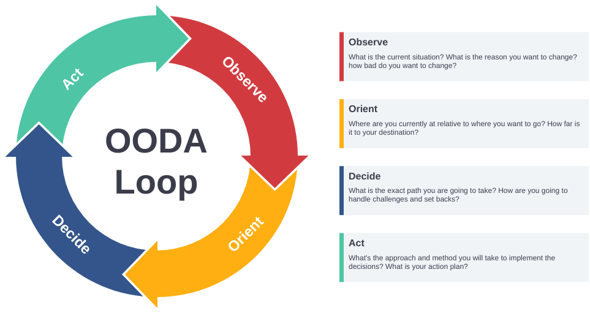
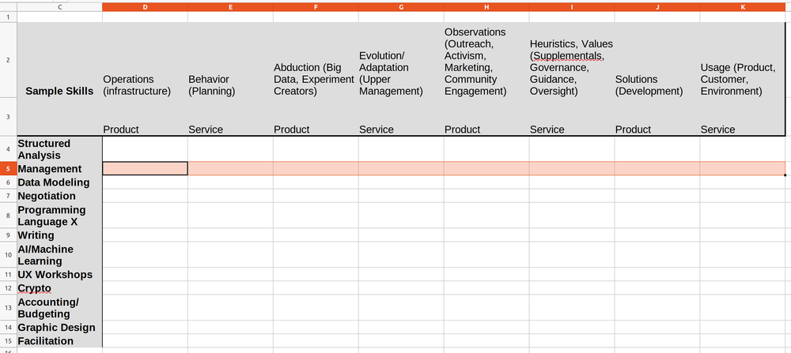

# Learning Exists in Natural Levels (Boyd)

*No matter what kind of organization you have or want, management doesn't go away. It's something to do and it's a skill and talent that some folks have to develop so that everybody overall can do better. How do you classify those skills?*

One of the things we don't think about is how much a great part of learning is deciding what to learn. We have to make decisions and prioritize them or we'd be looking at blades of grass while the forest burned.

Figuring out what to learn is much, much more important than learning itself. It's something in the tech world we hear all of the time: what the next tech I should be picking up?

Not only do you learn as you go along, managing what time you spend on what, you also have to manage how much importance to assign to the thing you learn. Learning math in school may be well worth the time, but it's probably a lower priority than learning to look both ways to cross the street. In both cases you've decided to assign time to learning, but you assign different weights to the result

## Survival Drives Focus

{width: 66%}

Is there a system for being a good fighter pilot? You might think that with the requirement that fighter pilots act almost instantly, engage in super-complex continuous maneuvers in multiple dimensions that the idea of having a "process" wouldn't work at all.

In the 1950s, the United States Air Force "grew" what many consider the greatest fighter pilot of all, John Boyd. Boyd was self-taught. Not only did he beat everybody the Air Force could throw at him, he was determined to research and figure out how he was able to perform so well.

From that study, he came up with the OODA model.

Like countless other models before and after OODA, it consisted of a loop. There's an old joke somewhere that you can't teach management theory unless you have a loop in there somewhere, and so far it's turning out to be true. But while the structure and flow of Boyd's model may work or not work, his categories seem to be something else entirely.

No matter what we're doing, whether it's fighting in a plane or figuring out a marketing campaign for next quarter, all of us need to Observe, Orient, Decide, and Act. We also need to do those things in a more or less continuous and ever-evolving fashion.

In my mind, management is the skill of removing obstacles for people and teams to succeed. Those obstacles, however, are not all the same. Let's use those Boyd's categories to talk about "levels" or types of management. We'll use a programming team as an example.

Management seems to happen when these categories come in pairs. Remember: Management is a skill, like negotiation, interviewing, database management, UX, or a thousand other skills. It's not a role. It's not a role because roles coordinate skills into something useful. Management is just another of those skills that can and should be used no matter what else you're doing.

## Management Learning Levels

**Decide-Act**. A pair programming team decides what to do next. That decision is codified by a test. They act to create the test, and as they create the test and integrate it into the rest of their formal model (hopefully!) that is the coding system, that action changes the testing decision, both current and previous. There's a back-and-forth between testing and coding, deciding and acting. That back-and-forth dynamic is what happens when we manage the code. (Interestingly enough, it also happens without formal TDD or pair programming. The only difference is that the "test" is either the code failing or the coder looking at something and not liking it. Also note that the test doesn't have to be executable. "It doesn't meet our coding standards" is something that can be tested. The word "test" is being used in a wide fashoin here.)

But what happens if they can't decide? They can't pick out a small test, or the tests they have don't seem to be able to be reconfigured to meet the rest of the systems or the standards. That's a Decision-Action management problem. Like all management problems, it's either handled there or given off to the next one up the chain.
When you get hung up on Decide-Act, it's because your decisions and actions don't work together. The system fails, you can't code it, it's not doing what it's supposed to do, and so on. You need help on figuring out how to make better decisions.

{width: 66%}

**Orient-Decide**.  The next level of back-and-forth is between where we are, what our goals are — and how to make the decisions needed to get there. This implies that as we move up in management levels/skills, we're responsible for both broader concepts and more "fuzzy" ideas. We're specifically responsible for taking those broader concept and fuzzy ideas and translating them into something more immediately useful to folks up and down the chain.

I assert witout support that (using our programming team example) these guys should code. They should also be able to work at the next highest level. Working at a level lower on a regular basis is the only way to understand the true nature of the problems people face instead of how they might express those problems. Working up a level both helps "manage up" and trains somebody for a future in the organization. Everybody is a manager in form form or fashion and everybody should be fluent at the level above and below where they work.

When you get hung up on Orient-Decide, it's because you're doing a (perhaps) great job at your tactical game, but you suck at strategy. That is, you can code most whatever you want to, and it works and fits in with the rest of the system. It's just not held together in any kind of overall sense that fits some kind of master plan. You don't have a problem executing. You have a problem organizing what you're executing.

**Observe-Orient**. What information do we have that leads us to the need to change? Why is a change necessary? How do we use that information both to position ourselves in the universe and figure out where we want to go?

When you have a Observe-Orient obstacle, it's not because you're not awesome at making multi-month, large projects happen. It's because they don't make anything useful and/or don't change realtime as conditions change around you. You've got a system for large, perhaps long-lived plans and you're rocking it, it's just not connected to what's happening in the real world. You are too internally-focused. Perhaps (probably) with an over-reliance on tools to do a lot of advanced naval-gazing.

**Act-Observe**. Ya, it's a loop. Or to put this more accurately, everything affects everything else. If we think about it in a loop or linear sense, at least we can organize things well enough to teach and talk about them

You are creating structures that implement behaviors that everybody in the organization wants. Yay you! But there's no feedback in place from what you're doing to everybody else. There's no DevSecOps pipeline with a dashboard (So that others who are making decisions can track your decisions and their impact on the org). There's no freeform reporting of problems (so that others can begin orientation by looking at multiple streams of execution for patterns). There's no instrumentation, telemetry, or active participation in the user audience with the people you're trying to help (so that others can see where the org is in relation to the rest of the universe).

In  a way, the primary thing for each of these levels to do is communicate freeform (not prepackaged computer forms) to everybody else about what's going on. The secondary thing for each of these levels to do is their job. Put another way, you have to repeat where you are, what you think you're doing, and why you can't (or can) do it. You have to do that using your own voice, mind, attitude, and worldview. After that, it's up to yourself and everybody else to process that into something useful. When there are obstacles in that processing, the skill of management helps the organization plan and evolve past them.

## Management Means Handling Greater Breadth and Less Depth

In this way, the more we think of management as a fixed, trainable, or structured field of study, the worse we'll do at it. The more we think of it as a mix-and-match art form, the better we'll be. I'm not saying that there's nothing to learn, there's a ton of really useful things. (Actually there's far too much for anybody to learn). I'm saying that management happens when we dynamically assemble all of those things to do what we want. It's jazz. It fails when we make it classical music. Lots of the really cool skills are like that.

We can also see that management happens when we interact with the other semantic categories. And we're always forced to do that. This has nothing to do with the problem, size of organization, or kind of work. Even one guy who's not part of any organization sitting down in front of an IDE is in this same place.

You can't just code, no matter what you're coding. At the very basic level, you think of something cool and what kinds of tech and style that you want. You might do that ahead of time or you might change it on the fly. You might make these plans based on the skills and experiences you think the job market needs.

You're doing all of this all of the time. You're self-managing. That's the best indicator we have that Boyd was on to something a lot more important than just how to be a good fighter pilot.

P.S. You may be wondering how all of this fits in with our earlier model and discussion around the MPO and scaling out Product Development. Of course, it doesn't have to fit in at all: models are useful until they aren't. Pick 'em up, use them for what you need them for, discard them. But scale and context-free models tend to be able to compose and assemble together. Sometimes joining them up give us a new context and scale-free view of something we couldn't see otherwise.

{width: 66%}

The MPO gives us a categorization system for conversations and activities around Product Development. Boyd gives us a management/decision model. The two do not conflict, and joining them together gives us a wonderful meta-model of how any-sized organization can discover and create things that people want without shooting themselves in the ass.

Let's play with that some more.
