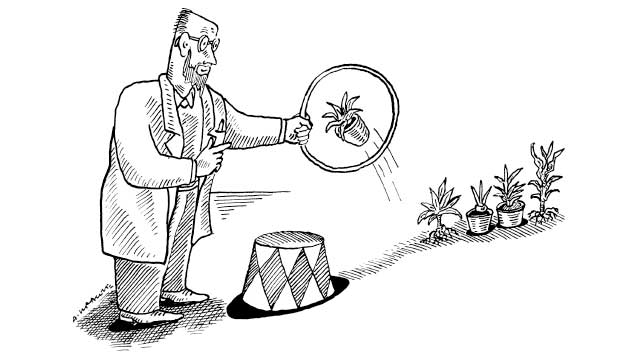

# Learning is Being Wrong

*A lot of what we do and learn isn't driven by lofty causes; it's driven by a fear of failure*

When we looked at management, we found that a productive way of seeing that activity was to think in terms of gaps, things that are missing. Various levels of management let us look at various things we might be missing in our work. The idea of a world of gaps will be a recurring theme in this book.

That makes sense because so much of learning is filling in the gaps after we recognize them. How do we recognize them? Through stress.

## Learning Always Happens Through Stress

Backing away from learning, we note that whenever we observe learning happening, it's always due to some form of stress. This observation applies across our range of experiences, from plant life to supercomputers. A plant has a biochemical need for sunlight.

Plants learning? That's stress. Over time, a plant learns where the sunlight is coming from in the morning. It moves to meet it. The fact that this is a chemical reaction doesn't make it any less learning. Right now we want to describe what learning is. If we do that well, then we'll have a better foundation when we get to the how and why of the matter.

Each individual plant senses its environment and changes to adapt to it over time, doing things to reduce its stress. That's learning. Plants learn, they just don't learn nuclear physics. Their stress inputs are very simple.

But doesn't learning require some form of intelligence? It's a good question. Let's set it aside for now and look at learning in the abstract. We'll get back to the relationship between learning, intelligence, sentience, and consciousness when we discuss artificial intelligence.

## Evolving and Maturing Changes Stresors

Just like we talked about levels in management, there are levels in the complexity of learning.

We see this in our own lives. When we were a baby, we got hungry at times. That hunger was a stressor. Without any sort of intelligence or master plan at all, we cried. That crying brought these large shapes into the room. They fed us. We learned something. A gap became obvious to us through biochemical activity. That recognized gap prompted our brain to try various things to fill it. Eventually it was able to come up with a good-enough-for-now system of cause and effect: crying brings food. Later on, this system got much more complex.

That's the system of stress-gap-response-learn we all see at the very simple level. Continuing to look at our own life experience, how does that generally change over time?

It gets very abstract, that's how. Instead of a very simple biochemical stress, we may become stressed because of an upcoming test, or the lack of the appropriate wine to serve at a fancy dinner we're hosting. The fact that all learning happens through stress doesn't mean that this stress is externally-generated and direct. In fact, what we see as organisms evolve and mature that these stressors become internal, abstract.

When I was in basic training, the DIs told us that back in the day, they used to beat recruits when they did a wrong thing. It was not out of hatred or malice. These people were getting ready to go into an environment where seemingly trivial mistakes could lead to a loss of life. It was important.

They stopped doing that, they said, not because the job had gotten softer, but because they wanted us to be the best learners possible. I remember one DI saying "I can beat a dog into doing whatever I want, but I've accomplished nothing except teach the dog fear and responses. What I want you guys to do is find it inside yourself to want to learn these things. I can't give you the internal drive you need to succeed. It has to come from inside."

## Avoiding Social Stress

As creatures evolve, they become more social. This social nature creates a kind of interactive stress that isn't just due to a more complex internal environment.

Study-after-study shows that looking bad, or social isolation, is the thing that people fear the most, even above death. As far as we can tell in humans, social stress is an extremely powerful form of motiviation. It's the most powerful we know about. Want to teach a child to swim? Don't take them by themselves to the river. Put them in a group of other children. Have them watch each of the other children taking the risk of swimming. Using social stress in this fashion is orders of magnitude more effective than lectures, demonstrations, or mentoring.

We want to fit in. We want to get along. Even those humans who are as anti-social as they can be, and I count myself among that group, have a powerful need not to look bad. (In fact, an odd thing happens as humans continue to try to pull-away from social pressure. Many times they end up being as civilly anti-social as possible, perhaps insulting even. Then they end up forming groups of people who are proudly not in groups. I want to be different, just like everyone else.)

As we perform our analysis on learning, we keep fighting the too-general vs too-minute battle alongside a recursive-infinity battle. It's as if learning were some form of fractal. From far away looking at a fractal, we might ask what shape it might be. Perhaps we answer that it generally looks like a circle. But then as we get closer, we realize there's no *actual* circle, there is no line around a point. Instead it's complicated. So we switch from looking outside-in to looking inside-out. What's the smallest shape we can see? Again, a simple question defies a simple answer. There is no smallest shape. The more we look the more detail there is, whether it's outside-in or inside-out.

Chaos and complexity are all around us in this fashion. Take, for instance, observing an ocean at the beach. There's water and sand. So where is the water? It's in that wave, but it's also in that sand. In fact, it's in the air. The water is *everywhere*. Yet we can point outwards and say "looks like the tide is coming in"

If we stay at the beach long enough, eventually we reach an understanding of molecules, pressure and gravitational waves, tidal action, and so forth. Eventually we come up with something that's good enough to answer most questions we have about water at the beach. The piece we started with, the word "water", might be good enough for conversation but it wasn't good enough for what we wanted to do.

Likewise, many of the terms we're using are good enough for conversation, just not good enough for us. Like those folks at the beach, instead of looking farther and farther away, or switching to a closer-and-closer look, we're going to combine both of those activities with general observations about our own experiences and the world around us. We're not going to take our words and pound them into our analysis, we're going to combine our words with behaviors we see to come up with new defintions, just like the folks at the beach come up with new definitions of "water".

We're going to accept being wrong and work through it.

## Using Careful Introspection About Our Stress-Response System

This comes easy enough for me. I make a lot of mistakes. Matter of fact, most of what I do and say is a mistake, measured by some metric. It's important to fully understand that, not in order to be a humble, better person or participate in a flavor-of-the-week self-improvement program, but because it contains the deeper knowledge that *everything learns by being wrong first*.

Don't believe me? Here are some places where being wrong is the most important part of existence.

- Training data and quality control for AI and Machine Learning, such as GPT-3
- Generative Adversarial Networks, or GANS, are entirely based on being wrong quickly and adjusting, even if there's no definition at all of what defines "wrong"
- Learning to feed yourself
- Learning to walk
- Forming a startup
- Making your startup successful
- Organizing knowledge workers
- Keeping an organization flexible and competitive

The GAN item is especially interesting because here we use the concept of wrong at huge scale and at a high rate of speed, even without really knowing what wrong means.

Whether it's machine learning, organizational learning, startups, or human learning, any sort of learning at all begins with some knowledge of how you're wrong. We call this knowledge "the feedback loop". If you've worked with organization or management people very long, you'll hear them talk about feedback loops. Oh my goodness, we love our feedback loops. Unfortunately, the phrase "feedback loop", is thrown out many times into discussions without anybody having any clear idea of exactly what's involved with it.  

So to begin our journey, before we do anything else, we're going to have to talk about being wrong: In popular English, instead of saying "I was wrong", we can say screwing up, striking out, eating dirt, going down in flames. (We have so many different euphemisms for being wrong. There's a reason for that.)

So it's being wrong, then feedback loops, then finally a look at cognition and consciousness. While we do that, we'll bounce around from experience to behaviors to details at scale. We'll still be wrong, but like the baby crying and then getting fed, we'll be wrong and happier. Then we're ready to start talking about learning at scale. If we do it right this'll allow us to accomplish a lot we couldn't otherwise.

