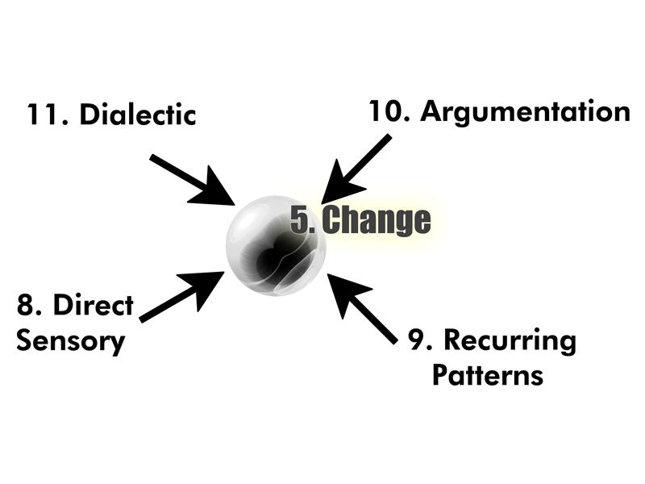

# Notional Neuron goes to the Learning Zoo

## Disclaimer

If we're going to learn about learning, we're going to have to talk about brains: biological brains, artificial brains, social brains, and a few more. In order to do that without getting lost in recursion, we're forced to create an artificial nomenclature, a bunch of labels that we can use to navigate our way around. We're not going to design a brain, but we're going to talk about the things a brain has to do. We're going to do that using an imaginary thought experiment neuron. We'll call him "Notional Neuron"

There are no justifications for these names or diagrams forthcoming. There will not be an extended discussion about theory, qualia, or the foundations of reality. That might come later. Instead, frankly, we're going to pull a bunch of concepts out of our ass and make nice diagrams with them. If the names and diagrams work to help us through the book, they've done their job. If not, it is left to the reader as an exercise. Good luck. Many have been down this road, never to return. Here there be monsters.

It's also important to understand that we are providing notional diagrams only. They are not meant to correspond to any particular thing in the real world. Where it's possible that there is correspondence it will be noted. Given this disclaimer, there should be many parallels and very few discrepancies with things we already know to be true.

Many of the "joining" ideas that connect up our nomenclature and general concepts are founded on lots of books and schools of thought and intellectual history. These situations will also be noted. What we have here is a pot pourri of creativity and hard science. Caveat Emptor.

Make no mistake, though: we want to be wrong. That's good. We want to be wrong in as useful a way as possible so that we can all learn more about learning than we knew before. There are two diametrically-opposed forces we need to join, biological and computational. If we're wrong in a good way we'll bring each side a little closer to the other. No instant miracles are contained here, only cool shit you didn't know before. Later we'll talk about how to do neat stuff with it.

## Learning from the Outside

The naive way to think about learning is to think about it from the outside. We all do that. We learn in many ways: there are a lot of physical things you might do: read a book, go to school, spaced repetition, apprenticeship, and so forth. There are millions of books, videos, recipes, products, and other things out there to help you learn, with more appearing daily. At heart, however, no matter what you're doing physically, mentally there's a finite number of ways to take things from the outside and make them part of your consciousness. Somehow or another, you're doing some form of mental work to get new learning inside. Here's the three different kinds of reasoning and how to use them to learn. Let's see exactly what that looks like.

## Induction

Induction is our natural life. We see something. We already know what it is and how to use it. We use it. We don't go testing every chair we come across to make sure it's a chair, even if it's a very weird-looking chair. We quickly categorize, sort, apply rules, and keep going. If you think about it, induction is done by plants as well as humans. Repeating a bunch of things you've memorized in a list without understanding is induction. It's a series of stuff we know and we're able to continue forward in the series without really knowing anything at all. It is the most naive way of reasoning about the world. It doesn't even require anything that we might consider intelligence.

![Contrast Induction to Deduction. Deduction takes specific structures and rules, applies formal logic to them, and then proves that other, more generalized structures and rules are forced to be true. Deduction is creating the machine that we then run using Induction. Induction moves from the general to the specific, taking loosely matched input and running precise rules, whereas deduction moves from the specific to the general, taking tightly-defined rules of logic applying them to loosely defined categories, and ending with statements about everything. Deduction creates the rules, Induction applies them.](resources/images/Deductive-Reasoning.jpg)

## Deduction

Anybody that's read a Sherlock Holmes book or watched a detective show has engaged in informal deductive reasoning. It's the kind of reasoning we think about when we think about "figuring stuff out".

The underlying concept to deduction is that we all have things we know to be true. These things can be the names of things, how things relate to one another, or how things act over time. These existing things we know to be true can be expressed in mathematical format. Our goal with deductive reasoning is to create a proof: If A->B and B->C, then A->C. The things we already know to be true, if thought about logically, create new things we also know to be true. New stuff we know comes through the rigid application of rationalism and logic. Yay science.

The trick to deduction is making sure we identify A, B, and C in this example and also making sure the "->" transform for each of the three statements meet certain criteria. Deduction only works when our input is good and our logical system is sound. Garbage in, garbage out.

## Abduction

Many of you are probably wondering what the hell abduction is. We never learned abduction in school! There's a good reason for that. Abduction is the creative part of science that we don't really talk about. Traditionally it's been difficult to teach formally so we just ignored it and stuck little bits of it here and there into other areas. Unfortunately, that makes understanding both abduction and those other areas more difficult. Let's untangle this.

Reasoning through abduction is just as important as the two other ways of reasoning. Our current tech implementations shows a severe lack of abductive understanding and practice. The big hole that's missing in AI right now is Abduction. Gotta have Abduction. If you look mainstream talk about abduction, it's not there but in order to do the best they can, they collapse part of it into induction and part of it into deduction. This makes a mess of things and makes it impossible to actually understand what's going on.

In plain words, abduction is just guessing stuff and being able to come up with some kind of reason why your guess might be right. This is another thing we do all of the time. Our brains are quite excellent at it.

If you've come here to learn about the current and future state of AI, you're in the right place. Abduction takes a seemingly big chunk of noisy stuff from all kinds of places and comes up with rules and creates loose associations that might explain them.

As an example, let's take the gherkin testing language based on RSpec. Gherkin describes computer tests. It is written in the format of Given-When-Then. Induction is simply When-Then. See that, do/think this. Deduction is simply Given-Then. Given this to be true, then that must be also be true. Abduction creates an entire chain, Given-When-Then, but it is in the form of a question, a hypothesis. Abduction is both tentative and creative.

## Learning Comes In Combinations

My thesis is that when looked at it from the outside, intelligent creatures learn by holding two points of the reasoning triangle still and letting the other one change as our brains continue to work.

Let's visit the "Learning Zoo"

- **Inductive/Deductive Learning**: We're coming up with new forms of abduction, things we believe to be true but aren't sure. We take data in categories we know to be true and using rigid rules we also know to be true (and where we also we believe both the categorization and rules to be applicable in this particular situation.) This type of learning can work in a closed room. It's context-free because you're reasoning in the abstract. The context comes later. It's very content-dependent, though, as the entire world of deduction happens based on strict rules about the content of the argument. We apply inductive and deductive reasoning, sometimes over-and-over again, until abductive reasoning provides a newer or simpler way of looking at things. Are there other categories we should be using for this data or other rules that make more sense in this situation?

This is thinking about science, not science itself. It's probably most clearly illustrated in the Socratic Method, where questions and logic are used in order to have the student guide themselves to a new understanding they didn't have before. We look at stuff we already have and wander if there isn't some better way of putting it all together. It's what we use as programmers when walk through somebody else's code we've never seen before and try to come up with why the original coder coded it that way. When we do that, we're learning how to abduce.

- **Inductive/Abductive Learning**: We're figuring out new forms of deduction, the rigid rules this universe operates under provided with a bunch of guesses and data. In contrast to inductive/deductive, inductive/abductive is very context-dependent. You need to know the exact situation here. You are constantly looking at the environment, the data, the situation and so forth. The details. What's the simplest form of logical system that works here? You don't know exactly what you're looking for, since so many things can affect so many others. It's content-free, though. You figure out what system of logic you're stuck in by watching the data go by and continuously categorization and rules to sort it all out. You're trying to create the simplest system possible to organize all of the existing data such that it's useful in other situations. You know the rules to make an infinite series of the stuff, you think you know why that's true. You're trying to find the structure, the *why*.

As you sort through things trying to find possible rules, you might create ad-hoc content, for example sometimes people sketch things on a whiteboard, but it's ephemeral. Mostly it gets thrown away until you get to the deductive part that holds true always.

This is breakthrough science, figuring out how the math/world works, or at least the beginnings of it. It's illustrated in an audience watching a murder mystery, a jury reaching a verdict, a reader reading a new fantasy novel, or a child figuring out if they throw food from their highchair a grown-up will magically appear and pick it up. Repetition of data occurs, rule guesses are created, and the process continues until we spot the underlying systems that are being used. We come to a system of logical rules that must always hold true in this universe. We're learning how create these systems of logic and categorization. We're learning how to deduce. We figure out the rules of what we're experiencing and how they must relate to one another.

- **Abductive/Deductive Learning**: We're coming up with new forms of induction, thinking about how to stop thinking. This is the end of science, or at least the beginnings of the end. This is where science ends because there's nothing left to figure out. You are given rules and categories in this universe along with all of the hypotheses that might be true in various ways and circumstances. We know a bunch of guesses that might be rules, we can work through the logic that takes these guesses and translates them into predictions, but it's a struggle matching them all up in order to mechanically predict future behavior.

This is the way many programmers operate. They're given a fixed set of rules that must apply (the programming language). They're given a bunch of guesses about how certain things have to appear and work. Their job bolt it all together in a mathematical system that runs by itself ad infinitum.It's interesting to note that this way of learning cannot by definition lead to any breakthroughs on its own, although it's required that we do this for those future breakthroughs to happen. Abductive/Deductive learning can only lead to a place where it stops working. If your inductive rules don't work for this context and data stream, you've got some learning to do. (in the other two areas). We're learning induction.

All of the arguments you hear about pure theory versus applied science boil down to people over-emphasizing either side of the Abductive/Deductive pair. Both are necessary. The missing piece here is abduction, as these are abductive arguments, but since we don't talk about abduction, many times the participants are lost at sea.

| Type of Reasoning  | What it represents  |
| --------- | --------- |
| Deduction | Categorization systems and rules that relate them |
| Induction | Easily calculating he possibly infinite number of next items in a particular situation |
| Abduction | Possible new deductive/inductive pairs to investigate |

## Channels of Change

Thinking about learning from the outside, those three forms of reasoning describe the magic that must somehow happen. If the "learning machine" was made of gears, how do we start the gears going? How does learning get inside a brain, however we define "brain"? Here are the levers we can pull from the outside when we want to learn to get the learning machine started.

- Direct Sensory
- Recursion of acting/sensing
- Repetition of acting/sensing
- Carrot/Stick
- Creation and comparison of abstract models

There's a heavy dose of recursion implied in this list. Recursion accounts for a lot of the missing pieces that would otherwise be listed. Recursion wreaks havoc with a lot of folks. It causes all sorts of problems, like the mind-body problem or the hard problem of consciousness. We're okay with those problems, however. We don't care. We're not trying to explain or diagram how reality works. We're sketching something on a napkin that will get us a little farther along down the road. We back away from the problem in this way in order to take the contradictions out, while leaving some good nuggets of insight to mine later.

## Learning from the Inside

We've covered as much as we want about learning from the outside-in, top-down viewpoint. We've talked about the forms of reasoning and how they are used in combination. We can observe them happening all around us. Now let's flip things over, move inside our magic box. Let's change from a top-down view to a bottom-up view. We're going to get a lot more speculative and talk about what learning might look like from the inside-out in, bottom-up in our magic learning machine. This same machine is everywhere, a bacteria, monkey, computer, startup, or person. Can we make one model that handles them all? A supermodel?

## Atom of Consciousness

What is consciousness? Beats me, but everybody seems to agree that it whatever it is, it has these three qualities, although the phraseology people us may be different: Act/Sense, Read/Change, and Predict/Enforce.

- **Consciousness Atom**. The Greeks a long time ago created something they called atoms, long before anybody had a clue what they were. Following in their footprints, we're naming "atoms of consciousness". Like the Greeks, we don't know what's in there, but by having these three attributes these atoms are able to combine in more and more complex fashions, eventually creating Scooter, the guy who changed your oil last week.

Also note that these new things we call "Consciousness Atoms" map to entirely different things in different situations. Continuing to use our atom metaphor, we know atoms must exist. We know a couple of things about them. There is a vast gap between knowing there is an indivisible piece of stuff and knowing how it all can work together. If these are atoms, we have no idea about molecules or chemistry. That doesn't mean we can't begin use them as intellectual props. In our system, plants have some sort of rudimentary consciousness. Plants do these three things through various plant cells. Humans, on the other hand, have an amazingly-complex web of consciousness existing all over the place. A bunch of these consciousness atoms exist in neurons. We believe that's where most of the high-level learning and consciousness happens. Remember, it's only a model. These are not physical things. Our Consciousness Atoms represent abstract structure and behavior for purposes of analysis only. For now, though, we'll limit our discussion to what happens once consciousness atoms come together with a bunch of other stuff to make neurons.
- **Act/Sense**. Hang on a minute, bub, aren't these opposites? Isn't "sense" passive and "act" active? Not in this context. Whatever we're calling a brain interacts with the outside world. That interaction might include the operation of simple sensors, movement or growth in the organism outside the atom, or any number of other things. However it happens, the organism can always reject incoming information, and it is always the case that it has acted in some fashion to receive information. Therefore, sensing and acting as far as an atom of consciousness goes are one and the same thing. We sense then act. We act, then sense. It's one and the same.
- **Read/Change**. When sensory information arrives, it has to go "somewhere". It's read and it changes some internal state. Perhaps there are magic monkeys. Beats me. It's atoms.
- **Predict/Enforce**. As more sensory information arrives and the state continues to change, patterns are observed, either to predict or prevent new patterns. Note that predict/enforce works with either one of the three nodes in our atom, two of those nodes, or in most cases a series of all three nodes working over a period of time recursively inside probability webs. Predict/Enforce receives information. It sends information back out to other groups of neurons. Sometimes that's the neurons in one particular consciousness stream, but most times the streams change up from sequence-to-sequence and the output goes all over the place. Predict/Enforce is where layering, recursion, probability webs, and emergent structure/behavior happens.

## Notional Neuron

You may have noticed that when I described Conscious Atoms, sometimes I referred to them as neurons. That's because Notional Neuron looks the same as our Consciousness Atom, only with more detail. Atoms come together to form a very similar system only at a larger scale. (Yes, you think inside of thinking, but there are only two levels of turtles here) Each of the three nodes inside our Notional Neuron are not just one thing, though. They represent an uncounted number of Atoms of Consciousness working in highly-complex ways. Neurons, whether in the real world or our little toy Notional Neuron, are probably the closest thing we have to biological entities that represent abstractions intelligent creatures create and use. Starting from the bottom and moving up, this is the first point that we start figuring out how learning and intelligence work. The mystery picture is beginning to come into focus.

We know Consciousness Atoms do these three types things but not how. Stick a bunch of them together into our Notional Neuron. Now we are beginning to see in general terms how these three types of things can work together. We use the Notional Neuron model to work downwards and talk about the mechanics/coding of AI. We use the same Notional Neuron model to work upwards and talk about creatures, societies, and so forth.

In other words, Consciousness Atoms come together to do much the same kind of work as neurons, only they do so in a way that we don't understand and are not going to explore. By adjusting parameters inside our Notional Neuron, we can create a target for that system of atoms, something all of those Consciousness Atoms need to form into in order for learning to work.  This lets us use the same model to cover all sorts of learning from babies to multinational organizations. In all of these situations we'll talk about, the name "consciousness atom" will exist in all sorts of things from lichen to supercomputers, but at the Notional Neuron level, this group of three topics remains the same. We have a way forward. We have a north star.

5. **Change**. Things have changed.
6. **Recognize**. What are those things that have changed and how do they fit into these other things?
7. **Predict/Enforce**. Does that make sense? What's going to happen next? What has to happen?

![Input arrives at some bunch of neurons hanging out together. We'll call that a brain. Input doesn't arrive at one neuron but a cluster (1). The first wave of signals go out from the neurons nearby (2). As that signal dies off, it kicks off a secondary round of signals firing (3). The secondary round kicks off yet a third primary round while the first signal is just dying off (4). The signal "storm" continues (5), with fading signals kicking off yet another primary signaling round, perhaps causing something externally to happen as shown lower-right. Item (6) Could represent the use of an internally-created abstraction. That's because we're seeing a complex sequence of atoms talking and as a result of that we have a new primary signal](resources/images/cloud-neurons-probability-web.jpg)

## Consciousness, Sentience, and Intelligence

Some made-up definitions to keep us coloring inside the lines:

- **Cognition Storm**. (Show in simplified format above). The interaction of huge numbers of neurons firing amongst themselves as signals decay. The above diagram omits at least several key elements:

1. Cognition storms happen in 3D, not 2D.

2. There are thousands, perhaps millions of neurons involved in any one storm, not just the few shown here.

3. Neurons may fire randomly even in the lack of signal being present

4. Input and output are never so clearly delineated. Instead the neural web dynamically "layers" itself to incoming and outgoing data.

5. While the reward system has been traditionally modeled as yes/no, pain/pleasure, levels of confidence, and so on, in fact there's a large amount of biochemistry involved. Certain hormones may impeded or accelerate certain kinds of signals. This would happen over a physical area, regardless of neural connections. Different hormones can be present simultaneously with one another. They conflict and interact with each other. We know things like this happen, but the details are largely a mystery.

- **Cognition Stream**. The series of neuron interactions that are involved from initial input to either die-off or another round of primaries.
- **Thought**. Internal representation (abstraction) of a related group/sequence of Cognition Streams as they occur. Does not persist.
- **Cognition/Abstraction Level**. All of the neurons currently receiving and transmitting data based on the same original input. This implies that there exists some record of signal path and a built-in hard decay rate limit.
- **Consciousness**: that which acts and senses its environment, changing itself internally and using those changes to both predict and/or enforce future actions and sensory responses.
- **Life**: bits of consciousness assembled inside a boundary, such that if the boundary is broken the bits of consciousness do not continue in the same way they did before and they never resume that pattern afterwards. Two lifeforms (boundaries) sitting side-by-side given the same input and environment will over time result in a different number of bits of consciousness and a different pattern of conscious activity inside the boundary, although many similarities may otherwise exist (different dogs can be very different and yet both still be a member of the set "dogs".)
- **Sentience**: lifeforms that are able to reason entirely in abstractions. The number instinct is an example the early abstractions that occur as sentience emerges in a species.
- **Intelligence**: Sentient lifeforms that are able to reason in abstractions over a shared medium and over periods of time exceeding the direct capabilities of individual lifeforms.

## Change

Our top node is called "Change" There are a fixed-number of ways change comes to our Notional Neuron:

8. **Direct Sensory Input**. Something has arrived from outside our neuron or probability-based current web of neurons. This is not a yes/no. Instead, input hits a system. It affects a bunch of neurons all connected to a bunch more. These billions of connections are all updated continuously in a probabilistic fashion. As the input rolls out from the source, it becomes direct sensory input for other neurons, only at a decreased intensity level. Eventually the signal dies off and does not affect any more neurons. (Intelligence is not only probabilistic, it's analog)
9. **Recurring Patterns**. Either the neuron we're looking at or neurons at roughly the same level of consciousness n our web (see above) are notifying us of a pattern.
10. **Argumentation**. Neurons at a lower level of consciousness have a major disagreement about predictions or violations. The code that runs in our brains has bugs (The brain has bugs. It always has bugs. The code always works. The bugs are just more or less annoying)
11. **Dialectic**. Neurons at a higher level of consciousness have a major disagreement about recognizing what's going on: the narrative, pain/pleasure received, what our reaction should be, or whether this current "storm" is productive. It's a kernel panic. (but it's not a brain panic. It's just a panic for this particular thought stream.)

## Recognize

Our next node, "Recognize" is where a lot of conflict gets handled. This conflict comes in these forms:

12. **Pain/Pleasure**. Degrees of success and/or failure are incoming, either from this neuron or our current web. Why? Is that what we were thinking would come next?
13. React. Immediate action occurred, either from us or our current web.
14. Re-Org, Re-factor. We are confused. Nothing is happening the way it's supposed to happen. Patterns of health are no longer present. Incoming information keeps failing to map up to our model.
15. **Change Narrative**. Either our story map or our position in the map is mistaken. Incoming information maps up to our model, but the predicted sequence continues to not match up to what we thought it was going to be. Other conflicts happen to us. Change Narrative conflicts happen when we look upwards and the bigger story doesn't work. Neurons do not only process information as it relates to itself. They also model what they think other neurons are going to do. (Or simulate, if you don't like the word model. See Mirror Neurons)

## Predict/Enforce

This is the part folks always focus on. At heart this is just a big analog connector working in a hard-wired way based on everything else in our Notional Neuron. The type of things it's connecting are just as important as the fact that they're all connected. It can send out new signals, recurse signals inside itself, or look for new connections. That's it.

## OODRA

On the left, along the outside of our diagram we see the classic OODA  decision/combat loop, only with "recursion" added in order to show how what we're really talking about are these nodes and loops existing in complex probability webs. We've already found out that probability webs are too much to draw. The word "recursion" does a lot of heavy-lifting here.

## Notional Neuron at a Glance

Here are all of the pieces put together into one diagram. No doubt, there's a ton of bullshit here. We expect that. It's an entirely imagined, man-made island. Note how Boyd's OODRA loop matches up nicely with the nodes and connections on the diagram. It's an indication that we can scale this out as-needed. We will find other indications as we move along. This discussion is our specification that we'll use and the road map we'll follow when we get to analyzing Artificial Intelligence and other forms of machine learning.

## Done

Our goal was to create a set of definitions and a rough map that we can use to talk about, reason, and discover new things about learning. We can use this with anything in complexity between a tree and a galactic super-intelligence. We have done so. Now onwards and upwards!

