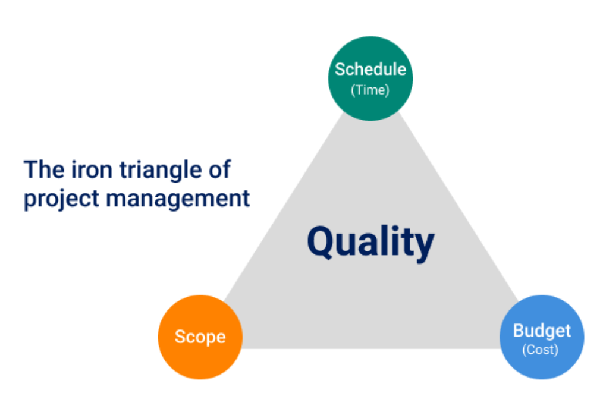
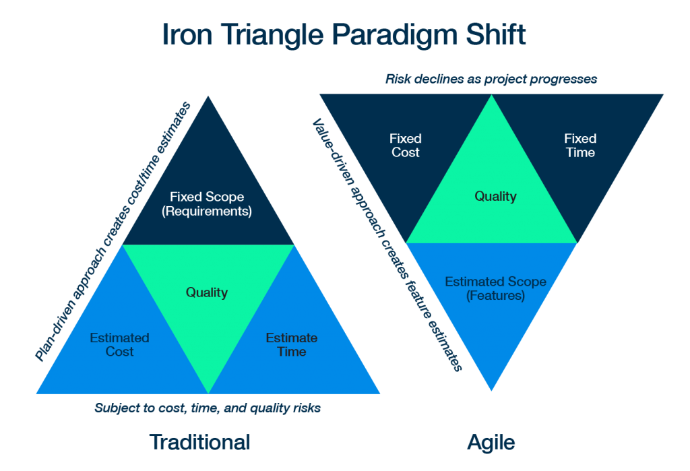
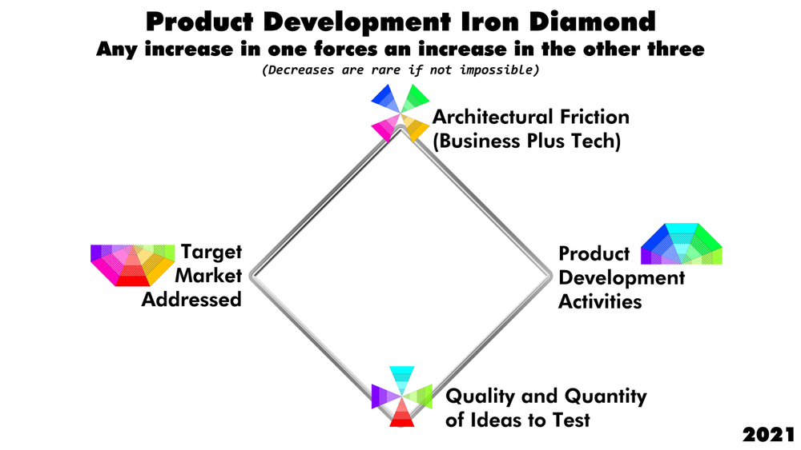

# The Iron Diamond of Product Development

*Technology projects are much, much more about Product Development than Project Management. Today we've got more technology product development goodness, with plenty more to follow.*

{width: 66%}

I was reading again today about the startup WhatsApp, a "little" company that sold for almost $20 Billion a few years back. There are a lot of interesting lessons to be had in both studying their story and how it parallels the story of many other successful startups. I thought that it would be fun to see how far I could distill those lessons down to just one concept.

{width: 66%}

Have you seen this? This is the traditional "Iron Triangle" of project management. Many people know this through the old saying, "Budget, Schedule, or Features. Pick two"

The idea of the triangle is that each of these items directly influences the other, i.e., you can't just fiddle with one without fiddling with all of them. After all, they call it the "Iron Triangle", not the "Triangle of Jello" The relationship between these things are fixed, indestructible. We can change each of the items, but we can't change how they relate to one another.

## Oldest Way, Old Way, and New Way

{width: 66%}

I've been known to teach Agile, XP, and Scrum. When folks teach those things, we take the project management iron triangle and flip it upside down. In the old, sequential way, waterfall, the idea was that the requirements (scope) and schedule were fixed. That meant that costs went through the roof and the schedule slipped anyway. The triangle always works. Contrast that with Agile implementations where costs and time are fixed. You are working in some kind of sprint or timebox. You have already allocated a chunk of time/money. In this situation, requirements must change to fit the other two items. "I'm coming back in a week with some cool stuff you'll love. Let's make some tests that describe that, then we can talk about whether or not it's too much to deliver in our fixed timebox"

The overall concept is that nature requires that some things be fixed and that others remain flexible. By explicitly acknowledging what things we are fixing in place, we give ourselves more freedom in other areas. When the principle is put in this generic way, it's a tremendously powerful lesson.

I believe this lesson was not lost on the gang at WhatsApp. If I had to restate the lesson that I think is hidden to most people, perhaps even the cool folks at WhatsApp that were actually doing it, it would be "artificial limitations" [Ed: If all you care about is the tech side, High Scalability has a great discussion on the technical aspect of the WhatsApp stack. Also you are completely missing out of the point of this essay. sigh]

If you go down the list of things describing the WhatsApp business model, you run across all kinds of rules. There are fixed limitations everwhere, across the organization. They have no meetings, like never. They insisted on an odd architecture but one that was built for scaling and resilience. (This reduced scaling work later on). They had a fixed number of developers. They decided they would never exceed that number. There are dozens more arbitrary limitations just like this.

When you look at their success from the standpoint of fixed-versus-flexible, their story is full of all sorts of self-imposed limitations. Most people reading their story might nod. They might even say to themselves "Wow, wouldn't it be great if we could do that?" and then go about their business. It's important to understand that the WhatsApp guys did not do this. Instead, they purposefully created hard complexity limits, like we did when we talked about Code Budgets. Then they forced everything else to fit inside of those limits. By constraining product development in this way, you actually free up the company to operate at warp speed.

Technology product development is much more than simple project management. Project management works on building widgets, it is generic enough to work on most all projects. Technology product development is not just about making and delivering a thing, it's about figuring out which things to make and at the same time how to market, sell, and deliver them. It's the difference between ordering your own custom-made pizza from the local shop and building your own restaurant and trying to figure out how to make the entire business concept work. It is at least an order-of-magnitude larger, more difficult, and more complex.

Continuing to see how simple I can make this, my thesis is that like the three things in the Iron Triangle for project management, there are four things fixed in relationship to one another in product development: target market, architectural friction, quality and quantity of ideas to test, and activities around the actual product development itself. As long as you're making money, the more constraints and corresponding less of these other things you have, the better. Here's where the both the words "iron" and "diamond" come into play: it's easy to increase the size of the diamond. It's almost if not completely impossible to scale it back once you've made it bigger.

It's not that easiest-to-use is better, in fact in most cases just the opposite. If it's easy to do something you usually end up doing more of it. The point here is that overall, smaller is better. Full stop. It may be tough having the requisite things in place to get started, you may be coding in something like Erlang, but if the overall size is small, even if it's tough sledding to get prepared, it's a win.

## Product Development Iron Diamond

**Architectural Friction**. You have to build things in order to build things. You have to have an infrastructure: servers, programming languages, IDEs, and so forth. These are all pre-existing structures of stuff you pull off-the-shelf and then customize for your needs. Again, initial work may be tough. (By "initial", I mean before anybody begins working with anybody else) Likewise, there are all sorts of business structures you might need: schedules, wireframes, canvasses, org charts, to-do lists, business plans, teams, working groups, job titles, and so forth. These various kinds of structures always come with a cost: they make your job easier or harder over time. Strangely, our intuition is always that we're making things easier.

Small frictionless architectures, both for business and technology, that stay small, that's the game. The minute that you can't work because of a meeting that's useless, the second that you can't add features because you're chasing down an obscure bug or updating to new framework code that implements cool stuff you'll never use, at that moment your organization begins to lose the battle against inertia.

**Product Development Activities**.  Our first item was about friction, ease-of-use over time. That's the architectural goal no matter which activities the architecture is supporting. Now let's talk about the activities themselves. Optimizing Product Development Activities: maximizing whatever you think you have to do while you're adding, maintaining, or testing various business hypotheses.

Take coding as an example. For people who've never been there, coding is what they think about when they think about developing new products: people sitting at little screens coding. Nerd magic happens here! If they only knew.

Certain things have to happen when you code. If you're coding using an imperative, mutable language, you have to create tiny tests before you code anything at all. In any kind of coding environment, you have to code acceptance tests before coding begins. You have to code using some sort of coding style. You have to code using a specific IDE, language, stack, and so forth. There's no right or wrong, but we can identify whether there are a small number of activities versus a large number of activities. There's no right or wrong, but there are real, measurable things. Tasks, items, time: many things are meaningless when we look at each one but provide a wealth of data when looked at in the aggregate. I don't have to tell you how to do something for both of us to look at it and see that it's working poorly.

It's important to understand that these items are fixed in relation to one another just like the items in the Project Management Iron Triangle. Continuing our coding example, Code Budgets arbitrarily keep your codebase small for any one feature. This activity makes the architecture full of many small pieces rather than a few (or one) large piece. That, in turn, limits the number of features/hypotheses we can develop against at any one time. This means we have to be very careful about both the quantity and quality of ideas in the pipeline. You can start at another point on the diamond and it works out the same. If you can tightly control one, you can tightly control all of them. The reverse is also true, losing control of one forces a loss of control over the others.

{width: 66%}

**Target Market Addressed**. When Facebook started, they had one market: friends at Harvard. This happens over and over again with successful startups. They find an extremely small market. They live in their lives. They make something that those people want that can't easily scale. Then they make it scale. Intutively we want to start with scaling first, but as we now see, all we do then is destroy any chance of success we might have before we even start.

Everybody wants to build the next Facebook, but even Facebook didn't build a Facebook. Small target markets mean fewer and better ideas. This reduces the other three items. Many startups begin with just one guy, a spreadsheet, a phone, and a website. This is called concierge product validation. If you're initial target market is 20 guys living down the hall, this comes naturally. If you're trying to build the perfect product for life, the universe, and everything, you're going to have a freaking huge diamond. Good luck with that.

**Quality and Quantity of Ideas to Test**. If you ask a mature programmer what's the hardest part about actually sitting down and writing code, it'll usually be "writing tests". That's because tests should drive architecture. You want a few tests working with a simple architecture that provides value. That's easier said than done, especially when our diamond grows more and more out of control.

The same holds true at the business level. You don't want a bunch of business models. You want one set of hypotheses that, when put together, validate one particular business model. When you're starting up, you want to cycle through these sets of hypotheses and models as you interact with people until you find one that works. This is also easier said than done, but if you're a tech guy studying product development, you should note the powerful cause-and-effect at play here: Simple business models validate quickly because they have fast build-test times, which means frictionless architectures, extremely-tight coding practices, minimal or no reporting or rituals, and tightly-limited target markets. Like the rest of the diamond points, once you start expanding one thing, you expand everything else out. It's easy to expand the diamond, impossible to contract it.

{width: 66%}

## Code Zero Zero Zero Destruct. Zero

You should also pay attention to the differences between what we're learning today and what folks traditionally learn about organizational change.

When we normally take teams or organizations and try to move them to the next level of performance, we take a bunch of concepts, introduce them a little at a time, then incrementally make what the business used to be into what they want the business to be. The underlying premise is that org change is like software, it's like project management, like Agile. We know Agile. It must be like that. What else could it be? If you're a hammer, the world is your nail. Our metaphors fail us.

My model says that this will never work. That's because a big reason teams and orgs are currently poor performing is that their diamond is too big, i.e. they're already doing too many things, there are too many options. This is regardless of whether those things are good or bad. It's too much to track, too much to do, and too many options for a technology group to ever be expected to do well. Piling on top of that is only going to make things worse.

Instead, we have to start with zero, we are in fact forced to start with zero, much the same that coders have to start with zero when solving problems. From there, we let the specific situation and problems give us no other option but to add structure and process, bit-by-bit, and then only under duress. Growing the diamond is easy. Shrinking it is damned impossible. Yes, we eventually grow our diamond, we loosen our arbitrary limits and start adding all the overhead and eventual cruft orgs always end up with, but only as a last resort. These occasions should be considered a failure.

Org change and group improvement then would be measured at an incremental series of tests, inflection points, that the organization gives to the team, when, and only when they're already delivering value and performing well. For instance, a test might be the ability to track team status inside a larger program on a daily basis. I've found when starting with zero teams can do this in five minutes a day or less, usually during their standups (if they have them).

Compare and contrast that type of reporting with the typical BigCorp Scrummaster who spends most of their time chasing around developers to get them to update massive online bug-tracking and productivity software. Taking that situation and adding new stuff, even just five minutes a day, is unworkable, as the current situation is already broken. You end up with two broken systems for bugs and performance, each of them just as broken as the other one. Now you have even less traction for positive change than when you started. And more cruft.

Once again, we are encountering the process side of Code Budgets or YAGNI, and like we see on the code side, it's extremely difficult not to add in things you really don't need, never use, and will only add overhead. It's a mirage. Without an immediate feedback loop, to us there seems to be no downside to pulling stuff off-the-shelf and plugging it in, it's all upside. The downside usually comes much, much later, and by then it's mixed in with so many other details about so many other things that the feedback loop is lost. This is when we gather together a top list of problems and ask our vendors to solve them. New things with new complexities are pulled from the shelf. We put out the fire by adding gasoline.

## We're Already Here

Know what? we've already been talking about this all along with all of our Info-Ops essays. Woot! We already have descriptions, practices, and measurements for all of the wedges in the MPO that describe the Iron Diamond. I feel like an Evil Master Villain laugh would be appropriate here. "And now my master plan has come to fruition! Now we can begin talking about how to minimize complexity in products and services and a bunch of other cool things. Mwahahahaha!"

Here we have yet more technology product development goodness. There's plenty more to follow.
